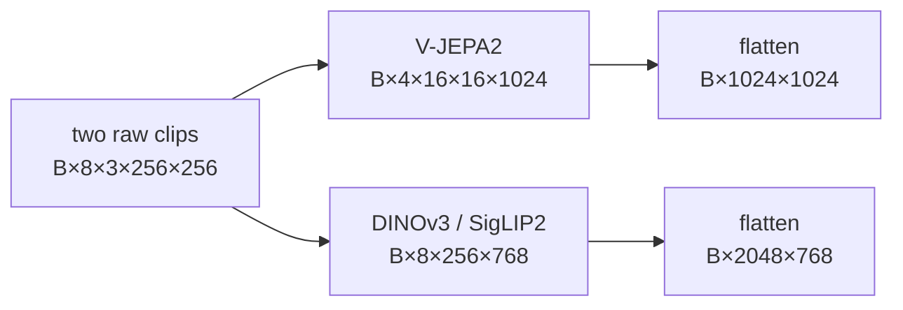

# Lesson 1 — Trace one video pair

**Time:** 15 minutes

**Goal:** derive the temporal indices, paired transformations, and encoder outputs without guessing.

[Course home](../README.md) ·
[Deep chapter](../chapters/02_DATA_AND_TEMPORAL_WINDOWS.md) ·
[Next lesson](02_open_the_bottleneck.md)

## Start with the equation

For `i=0,…,7`:

```text
context(i) = a + 2i
target(i)  = a + k + 2i
```

At shipped `k=4`:

| Window | Relative indices |
|---|---|
| context | `0,2,4,6,8,10,12,14` |
| target | `4,6,8,10,12,14,16,18` |

Six target frames are literal context frames. “Future-shifted” does not mean “disjoint.”

## Who owns what?

| Layer | Responsibility |
|---|---|
| raw transform | uint8→float, divide by 255, resize, paired crop, paired brightness/contrast/saturation, clamp |
| encoder | ImageNet or 0.5 normalization, patch/tubelet geometry, frozen feature extraction |
| provenance | transform version, dataset inventory, per-sample seed formula, encoder fingerprint |

Context and target are concatenated before stochastic transforms so both receive the same crop and
color draw. This preserves temporal correspondence.

## Shape checkpoint



DINOv3 initially exposes 261 tokens per frame, but the adapter removes one class token and four
register tokens, retaining exactly 256 patch tokens.

## Challenge

Write every answer before moving to the key.

1. At `k=12`, list the target indices and exact overlap.
2. Why is `k=15` both exact-overlap-free and span-disjoint, while project guides commonly say
   “16+”?
3. What is the V-JEPA detailed output for batch 64?
4. What is the DINOv3 detailed output, and why is its token count not `8×261`?

---

## Answer key

1. Target: `12,14,16,18,20,22,24,26`. Frames 12 and 14 overlap, so exact overlap is 2/8.
2. Exact overlap disappears because odd target indices cannot equal the even context indices.
   Span separation requires `k>14`, so 15 qualifies. The normal experiment ladder uses even
   horizons, making 16 the first tested disjoint value.
3. `(64,4×16×16,1024)=(64,1024,1024)`.
4. `(64,2048,768)`. The adapter removes one CLS and four register tokens from each frame.

## Exit ticket

Explain why changing `k` changes the data task but not the current model signature.

Continue to [Lesson 2](02_open_the_bottleneck.md).
