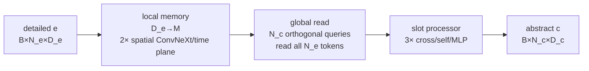

# Lesson 2 — Open the bottleneck

**Time:** 20 minutes

**Goal:** know where space, time, and slots interact—and why initialization begins as a template.

[Course home](../README.md) · [Previous](01_trace_the_clip.md) ·
[Deep chapter](../chapters/04_BOTTLENECK_INTERNALS.md) ·
[Next lesson](03_follow_the_gradient.md)

## Whole path



## Where mixing happens

| Axis | Mechanism |
|---|---|
| space | 7×7 depthwise convolution mixes neighbors inside each temporal plane |
| time | latent cross-attention reads the full flattened memory containing every temporal plane |
| slots | latent self-attention lets learned query identities exchange information |

ConvNeXt does not convolve across time: temporal planes are folded into the batch during the local
stage. Time first becomes globally accessible at learned-query cross-attention.

## Initialization

The following output bridges start at zero:

1. cross-attention output projection;
2. self-attention output projection;
3. final MLP projection in each latent block.

Therefore every input video initially maps to the same normalized learned-query template. The input
and attention machinery exists, but input-dependent residual contributions must be opened through
training.

## Parameter skeleton

```text
P_B =
 input projection
+2 × ConvNeXt
+token KV preparation
+detailed position table
+abstract queries
+3 × latent block
+optional M→D_c projection
+final LayerNorm
```

Width `M` dominates quadratically. Detailed-token count and abstract-query count contribute linearly.

## Challenge

Answer before reading the key.

1. Does ConvNeXt mix time?
2. Why can the learned attention temperature have delayed useful gradient?
3. Why is the frame-encoder bottleneck larger than V-JEPA's at `M=256`?
4. State V-JEPA bottleneck counts at `M=256` and `M=512`.

---

## Answer key

1. No. Time is folded into the batch; global cross-attention later sees all temporal planes.
2. The zero cross-attention output bridge initially prevents input-dependent attention output from
   affecting the loss. Attention geometry matters increasingly as the bridge opens.
3. Its learned position table has 2,048 instead of 1,024 rows. That increase more than offsets its
   narrower `768→256` input projection.
4. 4,837,123 and 18,324,739.

## Exit ticket

Draw one latent block and mark all zero bridges without notes.

Continue to [Lesson 3](03_follow_the_gradient.md).
