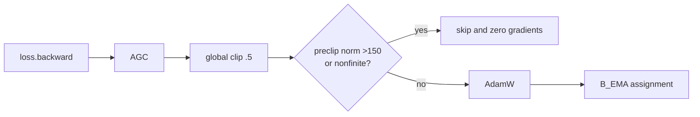

# Lesson 3 — Follow the gradient

**Time:** 20 minutes

**Goal:** for any loss, name every module it can change and the boundary where it stops.

[Course home](../README.md) · [Previous](02_open_the_bottleneck.md) ·
[Gradient reference](../reference/gradient-map.md) · [Next](04_read_the_run.md)

## Loss-to-module map

| Loss | `B` | `F_c` | `D` | `B_EMA` / `E` |
|---|---|---|---|---|
| flow | condition route | direct | — | stopped |
| variance/covariance/slot/SIGReg | direct | — | — | — |
| present reconstruction | through `c_t` | — | direct | stopped |
| predicted reconstruction | condition + residual add-back | endpoint | direct | stopped |

## Commit is separate from gradient

The teacher never has a gradient. It changes only through the final EMA assignment. Conversely,
having a gradient does not guarantee a parameter commit: the whole optimizer transition can be
skipped by the survivability guard.

## Challenge

Answer before reading the key.

1. Does present reconstruction train the predictor?
2. In residual predicted reconstruction, why does `B` receive two routes?
3. If `D` is in AdamW but no reconstruction is active, does weight decay move it?
4. If `grad_norm` is 170 after AGC, what changes?

---

## Answer key

1. No. It decodes online `c_t` and reaches only `B` and `D`.
2. `B` supplies the live `F_c` condition and the direct
   `c_hat=c_online+delta_hat` residual add-back.
3. No. Its gradients are `None`, and AdamW skips those parameters.
4. No optimizer parameter and no `B_EMA` parameter changes. Gradients are zeroed. An active feature
   mean tracker may already have received its explicit pre-loss buffer update.

## Exit ticket

Reproduce the complete loss-to-module matrix from a blank sheet in under two minutes.

Continue to [Lesson 4](04_read_the_run.md).
