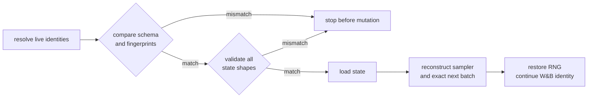

# Lesson 5 — Resume without scientific drift

**Time:** 20 minutes

**Goal:** distinguish loading weights from continuing the same experiment.

[Course home](../README.md) · [Previous](04_read_the_run.md) ·
[Deep chapter](../chapters/10_CHECKPOINT_RESUME_REPRODUCIBILITY.md) ·
[Quiz bank](../drills/QUIZ_BANK.md)

## A checkpoint is a state bundle

| State class | Contents |
|---|---|
| learned | `B`, `B_EMA`, `F_c`, `D`, AdamW |
| auxiliary | feature mean, whitener, resolved config |
| continuation | next step, sampler epoch/offset, Python/NumPy/Torch/CUDA RNG |
| identity | encoder, dataset, initialization, provenance, W&B run ID |

Loading only module weights creates a related model. It does not recreate the interrupted
experiment.

## Validate before mutate



Sampler reconstruction:

```text
batches_per_epoch = floor(N/B)
epoch             = next_step // batches_per_epoch
batch_index       = next_step % batches_per_epoch
sample_offset     = batch_index × B
```

## Challenge

Answer before reading the key.

1. At SSv2-tiny `next_step=7500`, what is the sampler state?
2. What does a checkpoint at step 2,500 mean?
3. What can explicit dataset transfer relax?
4. Why is W&B not a checkpoint backup in this project?

---

## Answer key

1. There are 62 batches/epoch: epoch 120, batch index 60, sample offset 3,840.
2. Updates 0–2,499 are complete; update 2,500 is next.
3. Only dataset fingerprint, data order, and data configuration. Seed, runtime, encoder,
   initialization, loss, and schedule controls remain guarded; old sampler continuity is discarded.
4. The trainer uploads provenance and optional whitening artifacts, but records only the final
   checkpoint path and SHA-256 in the run summary. It does not upload checkpoint bytes by default.

## Exit ticket

Explain exact remote resume in three minutes, ending with final checkpoint SHA-256 and W&B
continuation identity.

Finish with the [closed-book quiz bank](../drills/QUIZ_BANK.md) and
[whiteboard drills](../drills/WHITEBOARD_DRILLS.md).
