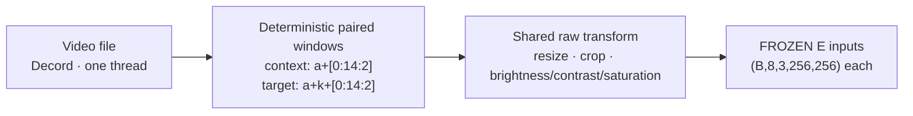
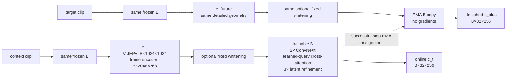
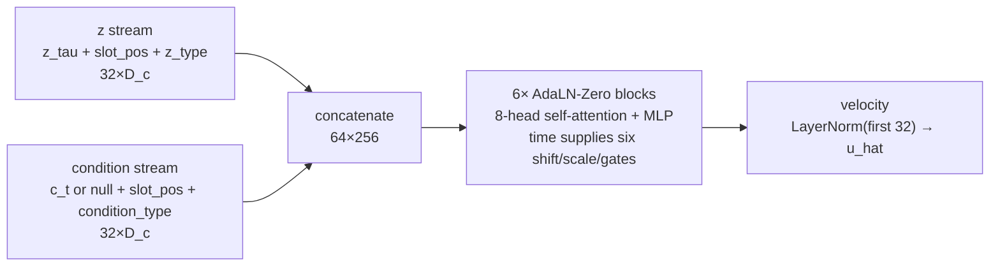
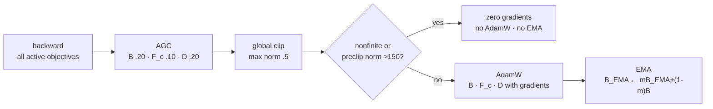
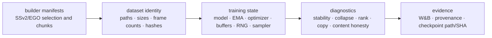
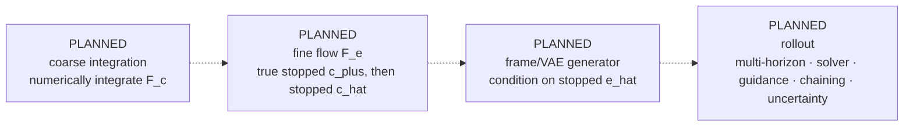

# Architecture from RGB to evidence

**Visual reference · audited 2026-07-25**

[Course home](../README.md) · [Tensor atlas](tensor-atlas.md) ·
[Gradient map](gradient-map.md) · [Training schedule](training-schedule.md) ·
[Full system chapter](../chapters/01_SYSTEM_OVERVIEW.md)

This page compresses the executable architecture, state transitions, and planned hierarchy into one
reference. Solid Mermaid nodes are implemented. Nodes explicitly labeled **PLANNED** are not
executable.

| Label | Meaning |
|---|---|
| **IMPLEMENTED / TRAINABLE** | executes in Phase 1 and receives optimizer gradients when its route is active |
| **FROZEN** | executes but has no trainable state transition |
| **EMA** | changes by assignment after a successful optimizer update, never by backpropagation |
| **PLANNED** | architecture intent that is absent from current code |
| **STOP** | detached target or mutation guard |

## Current Phase 1: paired inputs

> **Temporal warning:** shipped `k=4` shares six of eight decoded frames. The first normal even
> non-overlapping horizon is `k=16`.

## Current Phase 1: online and teacher paths

Key facts:

- Production detailed geometry comes from the resolved `EncoderSpec`.
- Whitening, when enabled, sits at the common detailed-feature seam and is seen by every consumer.
- `B_EMA` is a deep copy of `B`, updated only after successful AdamW.
- There is no target encoder. The shared encoder `E` is already frozen; the EMA exists only at `B`.

## Three learning surfaces

| Surface | Core computation | Direct gradient destinations |
|---|---|---|
| geometry | variance floor, optional covariance, slot diversity, SIGReg on online `c_t` | `B` |
| dynamics | `z=(1-τ)ε+τc_plus`; `u=c_plus-ε`; `F_c(z,τ,c_t)→u_hat` | `F_c`; `B` through live condition |
| content | `D(c_t)→e_hat_t` or `D(c_hat)→e_hat_future` | present: `D,B`; predicted: `D,F_c,B` |

Targets from `E` and `B_EMA` are detached. A metric or target may participate in a forward
calculation without becoming a gradient destination.

## Inside coarse flow

Condition dropout replaces an entire example's condition stream with the learned null condition.
The `z` and condition type identities prevent concatenation from erasing stream roles.

## Successful state transition

The optional residual-reconstruction mean is a mutable buffer updated before backward. A later
gradient skip does not roll that buffer update back.

## Full experiment architecture

The model graph alone is not the experiment. Dataset/encoder/whitening identities, exact sampler
position, RNG state, tracking identity, and durable checkpoint evidence are architectural state.

## Planned hierarchy — not executable

Current `D` reconstructs frozen encoder features. It is not the planned frame/VAE generator.
Current `c_hat` is a one-step algebraic endpoint estimate, not a numerical inference rollout.

## Memory sentence

> Frozen detail → trainable abstract slots → EMA future target → conditional abstract flow →
> optional feature reconstruction, enclosed by deterministic data and strict experiment identity.

Sources: current [data](../../data.py), [encoders](../../encoders.py),
[models](../../models.py), [training](../../train.py), and the
[audited source ledger](../SOURCE_LEDGER.md).
