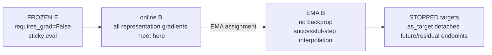
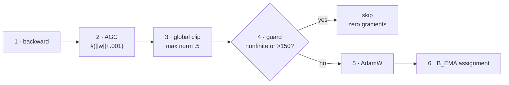

# Who changes what?

[Course home](../README.md) · [Architecture](architecture-map.md) ·
[Tensor atlas](tensor-atlas.md) · [Training schedule](training-schedule.md) ·
[Full gradient chapter](../chapters/07_LOSSES_AND_GRADIENT_ROUTING.md)

Gradients, EMA assignment, mutable buffers, and frozen state are different mechanisms. This map
keeps them separate.

## Objective-to-module matrix

| Signal | Frozen `E` | Online `B` | `B_EMA` | `F_c` | `D` | Feature mean | Whitener |
|---|---|---|---|---|---|---|---|
| ordinary flow | frozen | gradient through condition | detached target | gradient | — | — | read |
| residual flow | frozen | gradient through condition | two detached targets | gradient | — | — | read |
| variance | — | gradient | — | — | — | — | — |
| covariance | — | gradient if `λ>0` | — | — | — | — | — |
| slot diversity | — | gradient if `λ>0` | — | — | — | — | — |
| SIGReg | — | gradient if `λ>0` | — | — | — | — | — |
| present reconstruction | detached target | gradient | — | — | gradient | read/update* | read |
| predicted reconstruction | detached target | condition/endpoint gradient | detached target | gradient | gradient | read/update* | read |
| successful state transition | unchanged | AdamW | EMA assignment | AdamW | AdamW if gradient exists | already updated* | fixed |
| skipped state transition | unchanged | no AdamW | no EMA | no AdamW | no AdamW | may have updated* | fixed |

\* The residual-reconstruction mean is updated before loss/backward. The gradient skip guard does
not roll that buffer update back. It is mutable buffer state, not an optimizer transition.

## Gradient routes

### Flow

```text
L_flow
├──→ F_c velocity parameters
└──→ B through live condition c_t

STOP: detached B_EMA target and frozen E
```

### Present reconstruction

```text
L_recon_present
→ D
→ B through online c_t

F_c is not executed by this route.
```

### Predicted reconstruction

```text
L_recon_pred
→ D from decoded c_hat
→ F_c through the one-step endpoint
→ B through:
   1. live F_c condition
   2. residual c_hat = c_online + delta_hat add-back, when enabled
```

### Geometry regularizers

```text
variance / covariance / slot diversity / SIGReg
→ online c_t
→ B only

There is no direct F_c training from these losses.
```

## Detach and mutation boundaries



## Optimizer partition

| Decay and AGC eligible | No decay and no AGC |
|---|---|
| genuine Linear weight matrices | biases and all tensors with `ndim<2` |
| genuine convolution weight matrices | LayerNorm scale and shift |
| only parameters with an existing gradient | queries, positions, null condition, slot/type identities |
| | marked zero-init gates and output bridges |

Membership in AdamW does not guarantee movement. A parameter with `grad is None` is skipped,
including decoder parameters during a no-reconstruction baseline.

## Clip and commit sequence



> **Metric trap:** `grad_norm` is measured after AGC but before global rescaling.
> `grad_global_norm_postclip` is measured after the 0.5 clip and therefore often pins near 0.5.

## Quick retrieval

Answer all four before reading the key.

1. Does copy loss send a gradient?
2. Can `B_EMA` change on a skipped update?
3. Can the feature mean change on a skipped update?
4. Why is `D` in AdamW during a no-reconstruction baseline?

### Answer key

1. No. Copy is a fixed diagnostic baseline calculated under no-grad.
2. No. EMA assignment is gated by the same survivability decision as AdamW.
3. Yes, during active residual reconstruction. It updates before backward/skip and is not an
   optimizer parameter.
4. Stable construction and checkpoint structure. Its gradients are `None`, so AdamW skips it.

Sources: [losses.py](../../losses.py), [diagnostics.py](../../diagnostics.py), and
[train.py](../../train.py).
