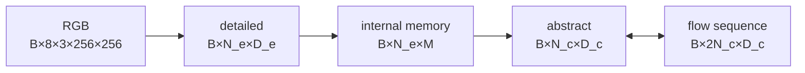

# Every important tensor and number

[Course home](../README.md) · [Architecture](architecture-map.md) ·
[Gradient map](gradient-map.md) · [Training schedule](training-schedule.md) ·
[Exact-number chapter](../chapters/17_EXACT_NUMBER_ATLAS.md)

Values are shipped defaults unless a row explicitly says experiment.

## Closed-book headline values

| Object | Shape / count | Interpretation |
|---|---:|---|
| raw batch | `64×8×3×256×256` | 6 MiB/video FP32; 384 MiB for one clip batch |
| V-JEPA detail | `1024×1024` per video | `4×16×16` lattice; 2 MiB/video BF16 |
| frame detail | `2048×768` per video | `8×16×16` lattice; 3 MiB/video BF16 |
| abstract `c` | `32×256` per video | 8,192 scalars; 16 KiB/video BF16 |

## Encoder ledger

| Encoder | Repository | Audited revision | Normalization | Lattice | Output/video | Parameters |
|---|---|---|---|---:|---:|---:|
| V-JEPA2 ViT-L | `facebook/vjepa2-vitl-fpc64-256` | `b3c167…ab26f` | ImageNet | `4×16×16` | `1024×1024` | 325,971,328 |
| SigLIP2 ViT-B | `google/siglip2-base-patch16-256` | `3f9f96…24c1ab` | mean/std 0.5 | `8×16×16` | `2048×768` | 85,843,200 |
| DINOv3 ViT-B | `facebook/dinov3-vitb16-pretrain-lvd1689m` | `593171…7896bc` | ImageNet | `8×16×16` | `2048×768` | 85,660,416 |

## Shape path



At shipped V-JEPA defaults:

```text
(B,8,3,256,256)
→ (B,1024,1024)
→ (B,1024,256)
→ (B,32,256)
↔ (B,64,256)
```

For SigLIP2/DINOv3, only detailed geometry changes:

```text
(B,8,3,256,256)
→ (B,2048,768)
→ (B,2048,256)
→ (B,32,256)
↔ (B,64,256)
```

## Parameter counts

`B` means online bottleneck, `F_c` the coarse flow, and `D` the feature decoder. “Bundle” adds the
frozen-gradient EMA copy of `B`; frozen encoder weights remain separate.

| Encoder geometry | `M` | `B` | `F_c` | `D` | Trainable total | Bundle + `B_EMA` |
|---|---:|---:|---:|---:|---:|---:|
| V-JEPA | 256 | 4,837,123 | 7,643,904 | 2,172,160 | 14,653,187 | 19,490,310 |
| V-JEPA | 512 | 18,324,739 | 7,643,904 | 2,172,160 | 28,140,803 | 46,465,542 |
| V-JEPA | 1,024 | 70,727,427 | 7,643,904 | 2,172,160 | 80,543,491 | 151,270,918 |
| frame | 256 | 5,033,731 | 7,643,904 | 2,106,368 | 14,784,003 | 19,817,734 |
| frame | 512 | 18,717,955 | 7,643,904 | 2,106,368 | 28,468,227 | 47,186,182 |
| frame | 1,024 | 71,513,859 | 7,643,904 | 2,106,368 | 81,264,131 | 152,777,990 |

## Core formulas

### Bottleneck

```text
P_B =
 D_eM+M
+2(8M²+57M)
+M²+M
+N_eM
+N_cM
+3(16M²+19M+1)
+optional(MD_c+D_c)
+2D_c
```

### Coarse flow

```text
P_Fc =
 2N_cD_c + 2D_c
+(8D_c²+5D_c)
+6(18D_c²+15D_c)
+2D_c
```

### Decoder

```text
P_D =
 D_cD_d+D_d
+4D_d²+4D_d
+2(12D_d²+13D_d)
+2D_d
+D_dD_e+D_e
```

## Temporal atlas

Context relative indices are always `0,2,4,6,8,10,12,14`.

| `k` | Target relative indices | Exact shared frames | 12-FPS shift |
|---:|---|---:|---:|
| 4, shipped default | `4,6,8,10,12,14,16,18` | 6 | 0.333 s |
| 12 | `12,14,16,18,20,22,24,26` | 2 | 1.000 s |
| 14 | `14,16,18,20,22,24,26,28` | 1 | 1.167 s |
| 16 | `16,18,20,22,24,26,28,30` | 0 | 1.333 s |

Exact-overlap freedom and span separation are different statements: span-disjoint requires
`k>14`; the normal even horizon ladder first satisfies it at 16.

## Memory ledger at batch 64

These are logical tensor sizes, not peak CUDA allocation.

| Logical tensor | V-JEPA | Frame encoder |
|---|---:|---:|
| one raw FP32 clip batch | 384 MiB | 384 MiB |
| context + target raw FP32 | 768 MiB | 768 MiB |
| one BF16 detailed batch | 128 MiB | 192 MiB |
| final BF16 bottleneck cross-attention map | 32 MiB | 64 MiB |
| feature mean FP32 | 4 MiB | 6 MiB |
| whitening buffers FP32 | approximately 8.004 MiB | approximately 4.503 MiB |

## Scientific decision gates

| Gate | Project threshold | What it protects against |
|---|---:|---|
| `c` population standard deviation | 0.8–1.2 | dead/exploding coordinates |
| cross-video cosine | below 0.5 | excessive cross-example similarity |
| effective rank | above 60 of 256 | low-dimensional collapse |
| model/copy loss ratio | at most 0.70 | failure to beat static persistence |
| model/batch-mean loss ratio | at most 0.50 | failure to use per-video condition |

These are project decision gates, not mathematical guarantees. Copy and batch-mean prediction gates
do not apply to present-only runs because that mode does not execute `F_c`.

Derivations: [parameter appendix](../appendices/PARAMETER_FORMULAS.md) ·
source snapshot: [ledger](../SOURCE_LEDGER.md).
