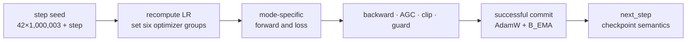

# Three clocks, one step counter

[Course home](../README.md) · [Architecture](architecture-map.md) ·
[Tensor atlas](tensor-atlas.md) · [Gradient map](gradient-map.md) ·
[Full schedule chapter](../chapters/08_TRAINING_STEP_AND_SCHEDULES.md)

Learning rate, optional-loss ramps, and EMA momentum share a step counter but use different formulas,
step-zero behavior, and endpoints.

## Conceptual timeline

```text
step             0          1.5k      2k                       15k               105k
                 │            │        │                         │                  │
LR scale         1/1500 ──── peak ─────╲ cosine decay ────────── 0 ─────────────── 0
loss ramp        0 ───────── 0.75 ──── 1 ─────────────────────── 1 ─────────────── 1
EMA momentum     .996 ───────────────── slow cosine rise ─────── .996193 ─────── .9999
```

The LR clock ends at 15,000. The optional reconstruction/SIGReg ramp normally ends at 2,000. EMA
momentum is scheduled conceptually over 105,000 latent steps, so it does not approach 0.9999 during
Phase 1.

## Exact formulas

### Learning-rate scale

```text
if step < 1500:
    scale = max(1e-8, (step+1)/1500)
else:
    p = min((step-1500)/13500, 1)
    scale = 0.5 * (1 + cos(pi*p))
```

### Reconstruction/SIGReg ramp

```text
if warmup <= 0:
    ramp = 1
else:
    ramp = clamp(step/warmup, 0, 1)
```

The shipped ramp denominator for both reconstruction and SIGReg is 2,000.

### EMA momentum

```text
p = clamp(step/105000, 0, 1)
m = .9999 - (.9999-.996) * .5 * (1 + cos(pi*p))
```

## Named steps

| Step | LR scale | `B`/`D` LR | `F_c` LR | 2k loss ramp | EMA momentum |
|---:|---:|---:|---:|---:|---:|
| 0 | 0.000666666667 | `6.6667e-8` | `1.3333e-7` | 0 | 0.996000000000 |
| 1,000 | 0.667333333333 | `6.6733e-5` | `1.3347e-4` | 0.5 | 0.996000872757 |
| 1,499 | 1 | `1e-4` | `2e-4` | 0.7495 | 0.996001960904 |
| 1,500 | 1 | `1e-4` | `2e-4` | 0.75 | 0.996001963520 |
| 2,000 | 0.996619178871 | `9.9662e-5` | `1.9932e-4` | 1 | 0.996003490247 |
| 7,500 | 0.586824088833 | `5.8682e-5` | `1.1736e-4` | 1 | 0.996048890571 |
| 14,999 | 0.000000013539 | `1.3539e-12` | `2.7078e-12` | 1 | 0.996193085394 |
| 15,000 | 0 | 0 | 0 | 1 | 0.996193110708 |
| 105,000 | 0 | 0 | 0 | 1 | 0.999900000000 |

Peak base rates are `1e-4` for `B`, `2e-4` for `F_c`, and `1e-4` for `D`.

## One update as a clocked state machine



The checkpoint's `step` is the next update to execute. A checkpoint named `step2500` therefore means
updates 0–2,499 are complete.

## Cadences over 15,000 successful updates

| Event | Cadence | Count |
|---|---:|---:|
| train log | every 50 | 300 |
| diagnostics | every 500 | 30 |
| scheduled checkpoint | every 2,500 | 6 |
| example presentations | batch 64 every update | 960,000 |

Diagnostics are also emitted on log steps when the owning condition is satisfied. The final atomic
save replaces the already scheduled `phase1_step15000.pt` path rather than creating a seventh
distinct next-step checkpoint.

> **CLI trap:** `--steps` changes loop length only. A 2k run is a prefix of the 15k schedule. A 20k
> run has zero LR after step 15k.

## Quick retrieval

Answer before reading the key.

1. Why is LR nonzero at step zero while reconstruction weight is zero?
2. Does EMA reach 0.9999 in Phase 1?
3. How many scheduled checkpoint paths are distinct?

### Answer key

1. LR warmup uses `(step+1)/warmup`; the optional-loss ramp uses `step/warmup`.
2. No. At step 15k it is about 0.996193 because its denominator is 105k.
3. Six: next-step paths 2,500 through 15,000. The final save atomically replaces the 15,000 path.

Formula source: [train.py](../../train.py) · defaults: [config.py](../../config.py).
