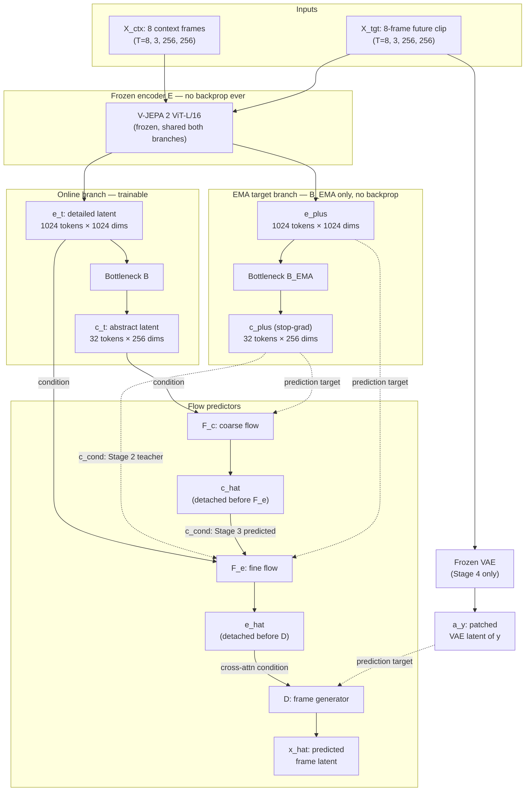
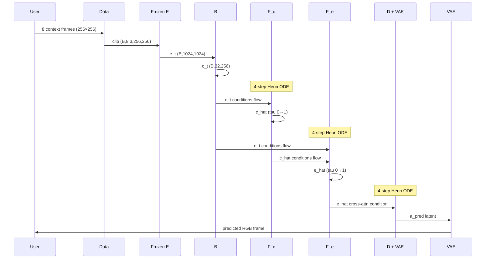

# HJEPA-VWM: Architecture & Phase-by-Phase Guide

> **Purpose:** A human-readable, in-depth walkthrough of what this project builds, how data flows
> through it, and what each implementation phase adds.
>
> **Repo state (v0.2):** Phase 1 is implemented (`config.py`, `data.py`, `models.py`, `losses.py`,
> `diagnostics.py`, `train.py`, `make_subset.py`). Phases 2 and 3 are fully specified in
> `AGENT_FILES/PHASES/` but not yet coded. Phase 4 (multi-horizon) is deferred.
>
> **Authoritative sources:** `AGENT_FILES/KNOWLEDGE/UNDERSTANDING.md`,
> `AGENT_FILES/PHASES/PHASE_*.md`, and `AGENT_FILES/KNOWLEDGE/BRIEF_V0_2.md`.

---

## Table of contents

1. [What problem are we solving?](#1-what-problem-are-we-solving)
2. [The big picture in one diagram](#2-the-big-picture-in-one-diagram)
3. [Core concepts you need first](#3-core-concepts-you-need-first)
4. [The two-level latent hierarchy](#4-the-two-level-latent-hierarchy)
5. [Every module explained](#5-every-module-explained)
6. [Data: from video file to training batch](#6-data-from-video-file-to-training-batch)
7. [Flow matching: how prediction actually works](#7-flow-matching-how-prediction-actually-works)
8. [Losses and what they train](#8-losses-and-what-they-train)
9. [EMA target branch: why it exists](#9-ema-target-branch-why-it-exists)
10. [Stop-gradient rules (non-negotiable)](#10-stop-gradient-rules-non-negotiable)
11. [Training stages 0–4 (150k steps)](#11-training-stages-04-150k-steps)
12. [Phase 1 — Coarse hierarchy (implemented)](#12-phase-1--coarse-hierarchy-implemented)
13. [Phase 2 — Fine hierarchy (planned)](#13-phase-2--fine-hierarchy-planned)
14. [Phase 3 — Frame generation (planned)](#14-phase-3--frame-generation-planned)
15. [Diagnostics and bypass tests](#15-diagnostics-and-bypass-tests)
16. [Inference: predicting a future frame](#16-inference-predicting-a-future-frame)
17. [Code map: which file does what](#17-code-map-which-file-does-what)
18. [Glossary](#18-glossary)

---

## 1. What problem are we solving?

**HJEPA-VWM** (Hierarchical JEPA-Flow Video World Model) learns to **predict the future of a short
video clip** — not by diffusing pixels, but by learning a **compressed internal representation** and
predicting how that representation evolves over time.

### What makes this different from "normal" video AI

| Typical video diffusion | HJEPA-VWM |
|---|---|
| Denoises pixels or VAE latents directly | Predicts **abstract** and **detailed latents** first |
| No forced hierarchy | **Two-level** hierarchy: structure (`c`) vs texture (`e`) |
| Hard to verify what the model "understands" | **Bypass tests** prove each level carries real signal |
| Encoder and decoder trained together | Frame decoder **only after** latents are verified |

The thesis: a good world model should compress what matters for the future into a **small abstract
state** (`c_t`), while keeping local appearance in a **larger detailed state** (`e_t`). If you
shuffle or zero out `c`, fine prediction should get worse. If you shuffle `e_hat` at decode time,
images should get worse. Those tests are the whole point.

### What the model sees and predicts

- **Input:** 8 context frames at 256×256 (`X_ctx`) — about 1.3 s of source video at stride-2 sampling
- **Target:** an 8-frame **future clip** at 256×256 ending `k` frames ahead (`x_{≤t+k}`) — for Phases 1–3, `k=4` (a single fixed horizon)
- **Encoder:** a **frozen pretrained V-JEPA 2 ViT-L/16** (`D_e=1024`) processes both; no patchifier code on our side
- **Dataset:** Something-Something V2 (SSv2) — short clips of human-object interactions where **direction and order matter**

---

## 2. The big picture in one diagram

At full maturity (after Phase 3), one training step looks like this. The key chain is
`E → e_t → B → c_t`: the detailed latent `e_t` is the **input to the bottleneck**, not a parallel
output. The same frozen `E` runs on both the context and the future clip.



**Phase 1** implements the frozen encoder, bottleneck, B_EMA, and F_c. **Phase 2** adds F_e.
**Phase 3** adds D and the frozen VAE.

---

## 3. Core concepts you need first

### JEPA (Joint Embedding Predictive Architecture)

Instead of reconstructing pixels, JEPA-style models **predict representations** of future content
from a context representation. The key requirement is that the predictor must infer future structure
from context — the representations must carry real signal, provable by bypass tests.

### Flow matching (rectified flow)

Rather than predicting the future latent directly, the model learns a **velocity field** that
transports Gaussian noise to the target latent along a straight path:

```
z(τ) = (1 - τ) · ε + τ · target     # interpolate noise ε and target
u = target - ε                       # constant velocity along that path
```

A network `F(z, τ, condition)` predicts velocity `u`. Training minimizes `||F(z, τ, cond) - u||²`.
At inference, you integrate from τ=0 (pure noise) to τ=1 (prediction) using a 4-step Heun ODE.

**Why flow matching?** It's a generative path starting from `N(0,I)` noise and is reused identically
for coarse (`F_c`), fine (`F_e`), and frame generation (`D`).

### adaLN-Zero (DiT-style time conditioning)

Flow networks condition on flow time `τ` by modulating LayerNorm scale/shift parameters. **Zero
initialization** means blocks start as identity — training ramps up gently from step 0.

### Variance floor (collapse prevention)

Instead of SIGReg, v0.2 uses a minimal variance floor on `c_t`:

```
L_var = (1/d) Σ_j max(0, 1.0 − Std(c_j))
```

This only prevents `c_t` from going constant. The flow objective does the actual learning. The
encoder `E` is frozen and cannot collapse; only `c_t` (the bottleneck output) needs this guardrail.

### Frozen pretrained encoder

`E` is a **pretrained, frozen V-JEPA 2 ViT-L/16** (HF: `facebook/vjepa2-vitl-fpc64-256`). It
processes the full pixel clip and internally handles tokenization, the tubelet-2 patch projection,
and 3D-RoPE position encoding. We never implement a patchifier on our side — we just call
`get_vision_features(clip)` and read out `(B, 1024, 1024)` tokens. Because it is frozen and shared,
there is **no target encoder** — `B_EMA` is the only EMA module.

---

## 4. The two-level latent hierarchy

Think of the hierarchy as **headline vs body text**:

| Latent | Symbol | Shape | Scalar count | Role |
|---|---|---|---|---|
| **Abstract** | `c_t` | 32 × 256 | 8,192 | Future-relevant **structure** — what is happening |
| **Detailed** | `e_t` | 1024 × 1024 | 1,048,576 | **Texture**, local appearance, fine spatial detail |

The abstract latent is roughly **0.8% of the detailed latent's scalar bandwidth** — the bottleneck
must be tight enough to prevent copying. If `c_t` had enough capacity it would just mirror `e_t` and
the hierarchy would be fake.

Token counts from the encoder geometry (V-JEPA 2: patch 16, tubelet 2):
- `N_ctx = (8/2) × (256/16)² = 4 × 256 = 1024` tokens
- `N_tgt = 1024` — the target is a clip with the **same geometry** as the context

**Future targets** use the same encoder on the future clip:

| Target | Symbol | Shape | Source |
|---|---|---|---|
| Future detailed | `e_plus` | 1024 × 1024 | Frozen `E` on `X_tgt` |
| Future abstract | `c_plus` | 32 × 256 | `B_EMA` on `e_plus`, detached |

Both are always **stop-gradient**.

---

## 5. Every module explained

### 5.1 Frozen encoder `E` — V-JEPA 2 ViT-L/16

**File:** `models.py` → `FrozenEncoder`

A thin wrapper around the HF pretrained model. No patchifier or position embedding code on our side.

- Input: clip `(B, T=8, C=3, H=256, W=256)`, ImageNet-normalized
- Output: `(B, 1024, 1024)` per-tubelet features from `last_hidden_state`
- `requires_grad=False` on all ~300M parameters; permanently in `eval()` mode
- The **same instance** is used for both the context path (`e_t`) and the target path (`e_plus`)

### 5.2 Bottleneck `B` — compression to abstract space

**File:** `models.py` → `Bottleneck`

Three-stage pipeline that squeezes 1024 tokens of dim 1024 into 32 tokens of dim 256:

1. **Input projection** `1024 → 256` (mixer width)
2. **Reshape + ConvNeXt mixing (2 blocks):** tokens reshaped to `(B·4, 16, 16, 256)` — 4 temporal
   slots × 16×16 spatial grid — then 2D ConvNeXt blocks mix local spatial context per temporal slot.
   Flatten back to `(B, 1024, 256)`.
3. **Cross-attention to 32 learned query embeddings:** queries `(32, 256)`, keys/values from mixed
   tokens, 8 heads. Output: 32 abstract tokens.
4. **Output MLP + LayerNorm** → `c_t` `(B, 32, 256)`

The same architecture is used by `B_EMA` on the target clip → `c_plus`.

### 5.3 EMA bottleneck `B_EMA` — stable targets

**File:** `models.py` → `TargetBottleneck`

A slow-moving copy of `B`, updated by the EMA rule after each optimizer step (not by backprop).
`requires_grad=False` on all parameters. Always in `eval()`. Produces `c_plus` from `e_plus`.

Because the encoder is **frozen and shared**, there is **no target encoder** — this is the entire
EMA machinery.

### 5.4 Coarse flow `F_c` — predict future abstract state

**File:** `models.py` → `CoarseFlow`

Predicts the velocity field from Gaussian noise to `c_plus`, conditioned on current `c_t`.

- 6 DiT blocks, dim 256, 8 heads (~5M parameters)
- **Conditioning:** concatenate `[z_c ‖ c_t]` → 64 tokens, run self-attention across all 64, read
  out the first 32 (the `z_c` half) as the velocity prediction
- **Condition dropout:** 10% of examples replace `c_t` with a learned null embedding (CFG-style)
- **Time:** adaLN-Zero modulation from `τ_c`

Phase 1 trains only `B` and `F_c` (the encoder is frozen throughout).

### 5.5 Fine flow `F_e` — predict future detailed state (Phase 2)

Not yet in `models.py`. Specified in `AGENT_FILES/PHASES/PHASE_2.md`.

Predicts velocity from noise to `e_plus`, conditioned on `e_t` and a coarse condition `c_cond`.

- 8 transformer blocks, dim 384, 8 heads (~14M parameters)
- Self-attention over 1024 noised target tokens `z_e`
- Cross-attention to memory = `concat(e_t, proj(c_cond))`
- 10% condition dropout replaces entire memory with a learned null

`c_cond` source:
- Stage 2: `c_plus` (teacher-forced oracle future abstract state)
- Stage 3: `stopgrad(c_hat)` where `c_hat = z_c + (1 - τ_c) · u_c_hat`

### 5.6 Frame generator `D` — pixels via VAE latent (Phase 3)

Not yet implemented. Specified in `AGENT_FILES/PHASES/PHASE_3.md`.

Renders future frames in the frozen `sd-vae-ft-mse` VAE latent space, conditioned on
`stopgrad(e_hat)`. 12 DiT blocks, dim 512, ~38M parameters.

---

## 6. Data: from video file to training batch

### 6.1 RunPod layout

```
/workspace/data/ssv2/train/          ← symlinks to .webm files
/workspace/data/ssv2/validation/
/workspace/data/ssv2/labels.json
/workspace/data/ssv2_tiny/           ← smoke subset (~4k train / 348 val)
/workspace/checkpoints/
/workspace/hierarchal-jepa-flow-world-model/   ← this repo
```

### 6.2 `make_subset.py` — creating ssv2_tiny

Stratified random sample: ~23 train + ~2 val videos per SSv2 class (174 classes). Creates
**symlinks only** — no re-encoding. Writes `manifest.json` with seed and counts.

### 6.3 `data.py` — what each batch contains

**File:** `data.py` → `SSV2Dataset`

Each `__getitem__` returns a **context/target clip pair** — both are 8-frame windows at 256×256:

| Field | Shape | Normalization |
|---|---|---|
| `context_clip` | `(8, 3, 256, 256)` | ImageNet stats (encoder expected) |
| `target_clip` | `(8, 3, 256, 256)` | ImageNet stats — the future window ending at `t+k` |

**Sampling:**
- Load video with `decord` (CPU, per dataloader worker)
- SSv2 ~12 fps; stride-2 sampling. Context window ends at `t`; target window ends at `t + k` (`k=4`
  in Phases 1–3)
- Random temporal start index each epoch (deterministic for val)
- Videos too short to provide both windows are padded by repeating the last frame

**Augmentations (train):** Resize shorter side to 256, random crop 256×256, color jitter
(brightness/contrast/saturation ±0.4, no hue). **No** horizontal flip, temporal flip, or rotation
— SSv2 labels are direction-sensitive. Same crop and jitter applied to both windows.

**Eval:** Shorter side to 256, center crop, no jitter.

**No tubelet dropout.** The frozen encoder never saw dropped tokens at pretraining; full clips are
fed. The dataloader returns all 8 frames.

---

## 7. Flow matching: how prediction actually works

### Training-time construction (coarse example)

For each batch element:

```python
# 1. Get e_t from frozen encoder (no grad)
with torch.no_grad():
    e_t    = E(context_clip)           # (B, 1024, 1024)
    e_plus = E(target_clip)            # (B, 1024, 1024)

# 2. Online bottleneck -> c_t (trainable)
c_t    = B(e_t)                        # (B, 32, 256)

# 3. EMA target -> c_plus (detached)
c_plus = as_target(B_EMA(e_plus))      # (B, 32, 256)

# 4. Sample noise and flow time
eps_c  ~ N(0, I)                       # (B, 32, 256)
tau_c  ~ Uniform(0, 1)                 # (B,)

# 5. Build interpolated state and ground-truth velocity
z_c = (1 - tau_c) * eps_c + tau_c * c_plus
u_c = c_plus - eps_c                   # constant velocity along rectified-flow path

# 6. Predict velocity conditioned on current abstract state
u_c_hat = F_c(z_c, tau_c, c_t)

# 7. Loss
L_flow = mean((u_c_hat - u_c) ** 2)
L_var  = variance_floor(c_t)           # guardrail, not a teacher
L      = L_flow + 0.10 * L_var
```

### One-step prediction (`c_hat`) — used in Stage 3

Under rectified flow, a single Euler step from `z_c` with predicted velocity gives an estimate of
the endpoint:

```python
c_hat = z_c + (1 - tau_c) * u_c_hat
```

This is **detached** before feeding `F_e` so fine-loss gradients never flow back into `F_c`.

### Inference-time (multi-step Heun)

Training uses one-step estimates for speed. **Deployment** integrates 4 Heun steps from τ=0 to τ=1:

```
z ← eps ~ N(0,I)
for each step: z ← heun_step(z, F_c(z, tau, c_t), dt)
c_hat_final ← z at tau=1
```

Same pattern for `F_e` (conditioned on `c_hat_final`) and `D` (conditioned on `e_hat_final`).

---

## 8. Losses and what they train

> Reminder: **stages** are the training-schedule phases (0–4); **implementation phases** (1–3) are
> how the code is built. Stage 1 = Phase 1; Stages 2–3 = Phase 2; Stage 4 = Phase 3.

### Stage 1 total loss (Phase 1)

```
L = L_flow + 0.10 · L_var(c_t)
```

No `L_e` yet. Variance floor on `c_t` only — the frozen encoder cannot collapse, so `e_t` needs no
regularization.

### Stages 2–3 total loss (Phase 2, latent stages)

```
L = L_flow + 1.0 · L_e + 0.10 · L_var(c_t)
```

### Stage 4 total loss (Phase 3)

```
L = L_frame    # only D trains; everything else frozen
```

### Gradient routing summary

| Loss | Trains | Never trains |
|---|---|---|
| `L_flow` | `B`, `F_c` | `E` (frozen), `B_EMA`, `c_plus` |
| `L_e` | `B`, `F_c`, `F_e` | `c_plus`, `e_plus`, `c_hat` (into F_e), **F_c** |
| `L_var` | `B` | everything else |
| `L_frame` | `D` only | `E`, `B`, `F_c`, `F_e`, VAE, `e_hat` |

---

## 9. EMA target branch: why it exists

If the bottleneck predicted against its **own immediate** encoding, two failure modes appear:

1. **Collapse** — representations become trivial constants that are easy to predict
2. **Chasing** — the target moves every gradient step; the predictor never stabilizes

The EMA bottleneck provides **slow-moving, stable targets**:

- `B_EMA` lags behind `B` by thousands of steps
- Targets are always detached — the online path learns to **catch up to** a smoothed future, not to
  rewrite the target
- EMA momentum cosine-ramps from 0.996 → 0.9999 over 105k latent-stage steps

Because the encoder `E` is **frozen and shared**, there is no `E_bar` — the same `E` runs on both
the context clip and the future clip. Only the **bottleneck** has an EMA copy.

---

## 10. Stop-gradient rules (non-negotiable)

These are architectural contracts. Breaking them invalidates the hierarchy tests.

| # | What | Why |
|---|---|---|
| 0 | `E` — no grad, ever | Pretrained; forward under `torch.no_grad()`, `requires_grad=False` |
| 1 | `e_plus`, `c_plus` always detached | EMA targets are predictions, not optimization targets |
| 2 | `c_hat` detached before `F_e` | Prevents `L_e` from training `F_c`; stops `c` becoming a texture carrier |
| 3 | `e_hat` detached before `D` | Frame loss must not rewrite the world model |
| 4 | `B_EMA` never in optimizer | Updated by EMA rule only |
| 5 | Latent stack frozen in Stage 4 | Decoder cannot shortcut around verified latents |
| 6 | VAE frozen always | Pretrained appearance prior |

**Code pattern:** centralized `as_target(x)` in `losses.py` returns `x.detach()`.

---

## 11. Training stages 0–4 (150k steps)

```mermaid
gantt
    title Training timeline (global steps)
    dateFormat X
    axisFormat %s

    section Latent
    Stage 0 sanity           :0, 0
    Stage 1 coarse (Phase 1) :0, 30000
    Stage 2 teacher F_e      :30000, 25000
    Stage 3 predicted c_hat  :55000, 50000

    section Render
    Stage 4 frame gen D      :105000, 45000
```



| Stage | Steps | What's trained | Key conditioning | Phase |
|---|---|---|---|---|
| **0** | 0 (sanity only) | Nothing — synthetic forward/back | — | 1 |
| **1** | 0 → 30k | `B`, `F_c` | `c_t` → `F_c` | 1 |
| **2** | 30k → 55k | `B`, `F_c`, `F_e` | `c_cond = c_plus` (teacher) | 2 |
| **3** | 55k → 105k | `B`, `F_c`, `F_e` | Ramp `c_plus` → `stopgrad(c_hat)` | 2 |
| **4** | 105k → 150k | `D` only | `stopgrad(e_hat)` | 3 |

`E` is frozen in every stage. `B_EMA` is updated by EMA in Stages 1–3; no EMA update in Stage 4.

### Stage 3 ramp (steps 55k → 60k)

```python
alpha = min(1.0, (step - 55000) / 5000)
c_cond = (1 - alpha) * c_plus + alpha * stopgrad(c_hat)
```

After step 60k: `c_cond = stopgrad(c_hat)` only — matches deployment.

### Learning rates

| Module | LR | When active |
|---|---|---|
| `E` (encoder) | **frozen — no optimizer group** | never |
| `B` (bottleneck) | 2e-4 | Stages 1–3 |
| `F_c` (coarse flow) | 4e-4 | Stages 1–3 |
| `F_e` (fine flow) | 4e-4 | Stages 2–3 |
| `D` (frame generator) | 2e-4 | Stage 4 only |

Latent schedule: 10k warmup, cosine decay over remaining 95k. Stage 4: separate 3k warmup + 42k
cosine.

---

## 12. Phase 1 — Coarse hierarchy (implemented)

### What Phase 1 delivers

Phase 1 is a **vertical slice**: data loading → frozen encoding → coarse prediction → training loop
→ diagnostics. It proves the abstract pathway works before adding complexity.

**Files:**

| File | Responsibility |
|---|---|
| `config.py` | All locked constants, paths, dataclasses |
| `make_subset.py` | SSv2-tiny symlink subset |
| `data.py` | Dataset, dataloader, augmentations — returns `(context_clip, target_clip)` |
| `models.py` | `FrozenEncoder`, `Bottleneck`, `TargetBottleneck` (B_EMA), `CoarseFlow` |
| `losses.py` | Flow matching, `variance_floor`, `as_target()` |
| `diagnostics.py` | 3 required `c_t` monitors, `F_c` baselines, gradient health |
| `train.py` | Stage 0 sanity + Stage 1 loop |

### Phase 1 training step

```
1. context_clip, target_clip = batch           # (B,8,3,256,256) each
2. with no_grad: e_t   = E(context_clip)       # frozen encoder
3. c_t = B(e_t)                                # trainable
4. with no_grad: e_plus = E(target_clip)
                c_plus  = as_target(B_EMA(e_plus))
5. eps_c, tau_c ~ N(0,I), U(0,1)
6. z_c = (1-tau_c)*eps_c + tau_c*c_plus
7. u_c = c_plus - eps_c
8. u_c_hat = F_c(z_c, tau_c, c_t)
9. L = flow_matching_loss(u_c_hat, u_c) + 0.10 * variance_floor(c_t)
10. backward, clip grad 1.0, optimizer.step()
11. EMA update: B_EMA ← blend from B   (no encoder EMA)
```

### Stage 0 — synthetic sanity

Before touching real data, `train.py --stage0-only`:
- Loads the frozen encoder; asserts 0 trainable encoder params
- Initializes `B_EMA` from `B` (`copy_weights_from`)
- Runs one forward/backward on random `(B,8,3,256,256)` clips
- Asserts no NaN; `B_EMA` params moved slightly; encoder params unchanged

Must complete in < 2 minutes.

### Required `c_t` monitors (W&B, every 500 steps)

These are the supervisor's minimum required metrics — all three logged at every `diag_every` step:

| W&B key | What it measures | Healthy range |
|---|---|---|
| `c_std_mean` / `c_dead_dim_frac` | Per-dim variance of `c_t` | dead_frac < 0.15 (warn) / 0.30 (stop) |
| `c_cross_video_cosine` | Mean pairwise cosine across different videos | well below ~0.5 |
| `c_effective_rank` | Covariance effective rank of `c_t` | > 60 |

### Phase 1 acceptance gates

| Gate | Criterion |
|---|---|
| Stage 0 | Synthetic forward/backward/EMA, no NaN |
| Frozen encoder | 0 trainable params; weights unchanged after a step |
| F_c vs copy baseline | model L_flow ≤ **0.70×** copy L_flow (after 10k steps) |
| F_c vs batch-mean | model L_flow ≤ **0.50×** batch-mean L_flow |
| `c_t` no collapse | effective rank > 60; dead_dim_frac < 0.15 |
| Cross-video cosine | well below ~0.5 |
| Training stability | 30k steps complete, no NaN/OOM |

### Commands

```bash
python train.py --stage0-only
python train.py --data ssv2_tiny --steps 500      # smoke
python train.py --data ssv2_tiny --steps 30000    # full Phase 1
```

### What Phase 1 explicitly does NOT include

- Fine flow `F_e`
- Shuffled-c bypass test
- Frame generator `D` or VAE
- Stages 2, 3, 4 training logic
- `eval.py`

---

## 13. Phase 2 — Fine hierarchy (planned)

### What Phase 2 adds

Phase 2 extends the codebase **without rewriting** Phase 1 modules. It adds the detailed prediction
pathway and the **central architectural proof**: the shuffled-c test.

**New/modified files:**

| File | Change |
|---|---|
| `models.py` | + `FineFlow` (`F_e`) |
| `losses.py` | + `L_e` helpers, `predict_abstract_one_step()` |
| `diagnostics.py` | + shuffled-c, zero-c, teacher-vs-predicted |
| `train.py` | Stages 2–3 loop, resume from Phase 1 ckpt |
| `config.py` | Stage boundaries, ramp steps, thresholds |

### Stage 2 — teacher-forced fine flow (30k → 55k)

The fine flow learns to predict `e_plus` with an **oracle** coarse condition:

```
c_cond = c_plus    # detached future abstract — "cheating" but intentional
```

This isolates F_e learning: can the detailed predictor work when given the **true** future structure?

### Stage 3 — predicted-coarse fine flow (55k → 105k)

Now F_e must work with F_c's guess of the future abstract state:

```
c_hat  = z_c + (1 - tau_c) * u_c_hat
c_cond = stopgrad(c_hat)    # after ramp completes
```

**Critical invariant:** `c_hat` is detached before entering F_e. `L_e` trains `B` and `F_e` — **not** `F_c`.

### The shuffled-c test — why Phase 2 exists

```python
L_e_real     = fine_flow(..., c_cond=c_hat_real)
L_e_shuffled = fine_flow(..., c_cond=permute(c_hat across batch))
ratio = L_e_shuffled / L_e_real
```

| Checkpoint | Required ratio |
|---|---|
| End Stage 2 (55k) | ≥ **1.5** |
| End Stage 3 (105k) | ≥ **2.0** |

Ratio ≈ 1.0 means `F_e` ignores coarse conditioning → hierarchy is fake. Ratio ≥ 2.0 means wrong
abstract structure meaningfully hurts prediction.

### Phase 2 acceptance gates

| Gate | Criterion |
|---|---|
| Resume | Phase 1 ckpt loads at step 30k |
| Shuffled-c @ 55k | ratio ≥ 1.5 |
| Shuffled-c @ 105k | ratio ≥ 2.0 |
| Zero-c ablation | null condition hurts `L_e` |
| `L_e` ↛ `F_c` | autograd: no grad from `L_e` to `F_c` params via `c_hat` |

### Command

```bash
python train.py --data ssv2_tiny --steps 105000 \
  --resume /workspace/checkpoints/phase1_step30000.pt
```

---

## 14. Phase 3 — Frame generation (planned)

### What Phase 3 adds

Phase 3 completes v0: turn verified latents into **visible pixels** via a frozen VAE and a
flow-based frame generator. The latent stack is **frozen** — only `D` trains.

**New files:**

| File | Responsibility |
|---|---|
| `models.py` | + `VAEWrapper`, `FrameGenerator`, rollout helpers |
| `losses.py` | + `L_frame` |
| `train.py` | Stage 4 freeze logic + D training loop |
| `eval.py` | **NEW** — all seven diagnostic tests |
| `inference.py` (optional) | `predict_next_frame()` |

### Decoder dependency test

Frame-level equivalent of shuffled-c:

1. Generate with real `e_hat` → measure L_frame or visual quality
2. Shuffle `e_hat` across batch → regenerate
3. **Shuffled must be worse** — if not, `D` learned its own appearance model and bypassed the world model

### Phase 3 acceptance gates

| Gate | Criterion |
|---|---|
| Stage 4 stable | 45k steps, L_frame decreases, no NaN |
| Freeze verified | no latent param gradients in Stage 4 |
| Decoder dependency | shuffled `e_hat` degrades output |
| Inference | `predict_next_frame()` returns sane RGB |
| eval.py | all seven tests run; thresholds met or flagged |

---

## 15. Diagnostics and bypass tests

Diagnostics run every **500 steps** on a **fixed validation batch** (cached at init).

| Test | What it catches | Phase | Pass threshold |
|---|---|---|---|
| `variance_stats(c_t)` | Dead dimensions / constant `c_t` | 1+ | dead_frac < 0.30 |
| `cross_video_cosine(c_t)` | Directional collapse (all videos → same `c`) | 1+ | well below ~0.5 |
| `effective_rank(c_t)` | Low-rank collapse of `c_t` | 1+ | > 60 |
| Coarse baselines | `F_c` not learning real dynamics | 1 | ≤ 0.70 / ≤ 0.50 ratios |
| **Shuffled-c** | `F_e` ignoring abstract latent | 2 | ≥ 1.5 → ≥ 2.0 |
| Zero-c ablation | Decorative coarse conditioning | 2 | null hurts `L_e` |
| Gradient health | NaN, explosion | 1+ | no repeated NaN |
| Decoder dependency | `D` bypassing world model | 3 | shuffled `e_hat` worse |

**The architecture exists to pass these tests.** A model that trains but fails shuffled-c or
decoder-dependency has not learned a real hierarchy.

---

## 16. Inference: predicting a future frame

Full pipeline at deployment (after 150k steps):



Entry point (Phase 3): `predict_next_frame(context_clip, models, cfg)` → `(B, 3, 256, 256)`.

---

## 17. Code map: which file does what

### Implemented (Phase 1)

```
config.py
├── ModelConfig     # architecture dims, encoder repo, grid geometry properties
├── TrainConfig     # steps, LRs, EMA schedule, lambda_var, logging intervals
├── DataConfig      # data_root, dataset name, workers
└── Config          # bundles above + checkpoint_dir, seed

data.py
├── SSV2Dataset     # decord load, stride-2 sampling, clip-pair returns
│                   # NO tubelet dropout — frozen encoder gets full clips
└── build_dataloader

make_subset.py
└── create_subset   # stratified symlinks → ssv2_tiny

models.py
├── FrozenEncoder   # thin HF wrapper; get_vision_features(); 0 trainable params
├── Bottleneck      # in_proj + ConvNeXt + cross-attn → c_t
├── TargetBottleneck # EMA copy of B; as_target() inside
├── CoarseFlow      # F_c: DiT velocity predictor (6 blocks, dim 256)
└── smoke_test_models()   # synthetic e_t — no encoder download needed

losses.py
├── as_target()           # centralized detach
├── interpolate()         # z = (1-τ)ε + τ·target
├── velocity_target()     # u = target - ε
├── flow_matching_loss()
└── variance_floor()      # per-dim std hinge on c_t (replaces SIGReg)

diagnostics.py
├── variance_stats()      # REQUIRED: per-dim std of c_t
├── cross_video_cosine()  # REQUIRED: mean pairwise cosine across videos
├── effective_rank()      # REQUIRED: covariance effective rank of c_t
├── coarse_baselines()    # copy + batch-mean comparisons
└── gradient_health()

train.py
├── run_stage0()          # synthetic sanity (loads real encoder)
├── train_step()          # one Stage 1 step
├── run_training()        # full loop + W&B + checkpoints
└── run_diagnostics()     # all 3 required monitors + baselines
```

### Planned (Phases 2–3)

```
models.py       + FineFlow, VAEWrapper, FrameGenerator, rollout helpers
losses.py       + predict_abstract_one_step(), phase2/3 total loss, L_frame
diagnostics.py  + shuffled_c_test(), zero_c_ablation(), teacher_vs_predicted_gap()
                + decoder_dependency_test()
train.py        + stage detection, Stage 2/3/4 loops, freeze logic, resume
eval.py         + standalone seven-test evaluation script
inference.py    + predict_next_frame() (may live in models.py)
```

### Agent documentation (specs the AI follows)

```
AGENT_FILES/
├── AGENTS.md                   # entry point, read order
├── KNOWLEDGE/
│   ├── UNDERSTANDING.md        # full architecture reference (§0–§14)
│   ├── BRIEF_V0_2.md           # edited working brief (v0.2)
│   ├── SUPERVISOR_FEEDBACK_EXPLAINED.md
│   ├── FROZEN_ENCODER_RESEARCH.md
│   └── ARCHITECTURE_CHANGES_AND_PHASE_PLAN.md
├── PHASES/
│   ├── PHASE_1.md              # build spec Phase 1
│   ├── PHASE_2.md              # build spec Phase 2
│   ├── PHASE_3.md              # build spec Phase 3
│   └── PHASE_4.md              # multi-horizon (deferred)
├── AGENT-BEHAVIOUR/
│   ├── PROTOCOL.md             # how agents must behave
│   └── CODE_DESIGN.md          # naming, file layout, docstrings
└── SETUPS/
    ├── SETUP.md                # human RunPod setup
    ├── SETUP_POD.md            # SSH + troubleshooting
    └── VOLUME_LAYOUT.md        # path contract
```

---

## 18. Glossary

| Term | Meaning |
|---|---|
| **Abstract latent `c`** | Low-bandwidth 32-token representation of future-relevant structure |
| **Detailed latent `e`** | High-bandwidth 1024-token representation of visual detail (from frozen encoder) |
| **`c_t` / `e_t`** | Latents of the **context** clip (online branch) |
| **`c_plus` / `e_plus`** | Latents of the **future** clip (EMA target branch, detached) |
| **`c_hat` / `e_hat`** | **Predicted** future latents from one-step or ODE flow integration |
| **`c_cond`** | Coarse condition fed into F_e (`c_plus` or `c_hat`) |
| **Flow matching** | Learning velocity fields along noise→target paths |
| **Rectified flow** | Straight-path CFM: `z = (1-τ)ε + τ·target`, `u = target - ε` |
| **τ (tau)** | Flow time in [0,1]; 0 = pure noise, 1 = target |
| **EMA** | Exponential moving average — slow copy of the bottleneck for stable targets |
| **Variance floor** | Per-dim std hinge on `c_t` to prevent constant outputs (replaces SIGReg) |
| **B_EMA** | EMA copy of bottleneck B; the only EMA module (no target encoder in v0.2) |
| **Condition dropout** | 10% replace conditioning with learned null (CFG-style) |
| **Teacher-forced** | Stage 2 uses oracle `c_plus` as F_e condition |
| **Predicted-coarse** | Stage 3+ uses F_c's `c_hat` as F_e condition |
| **Shuffled-c test** | Permute coarse conditions across batch — must hurt L_e |
| **Bypass test** | Any diagnostic proving a module can't be ignored |
| **Heun ODE** | 2nd-order ODE integrator for inference rollouts (4 steps) |
| **SSv2** | Something-Something V2 dataset |
| **ssv2_tiny** | Stratified ~4k subset for fast smoke training |
| **`D_e`** | Detailed latent dimension = 1024 (set by frozen V-JEPA 2 ViT-L/16) |
| **`N_ctx`** | Context token count = 1024 — `(T/tubelet)×(H/patch)²` = `4×16×16` |

---

## Quick reference: phase → stage → capability

| Phase | Global steps | Stages | You can... |
|---|---|---|---|
| **1** | 0 – 30k | 0, 1 | Encode video → abstract latent; predict future `c_plus` with F_c |
| **2** | 30k – 105k | 2, 3 | Also predict future `e_plus` with F_e; prove hierarchy via shuffled-c |
| **3** | 105k – 150k | 4 | Render predicted future frame as RGB via D + VAE |

---

## Suggested reading order

1. This document — full pipeline mental model
2. `AGENT_FILES/KNOWLEDGE/UNDERSTANDING.md` §1, §4, §5, §6 — precise shapes and gradient table
3. `AGENT_FILES/KNOWLEDGE/SUPERVISOR_FEEDBACK_EXPLAINED.md` — the v0.2 design rationale
4. `models.py` + `train.py` — Phase 1 code matching the diagrams above
5. `AGENT_FILES/PHASES/PHASE_2.md` — before fine flow is implemented
