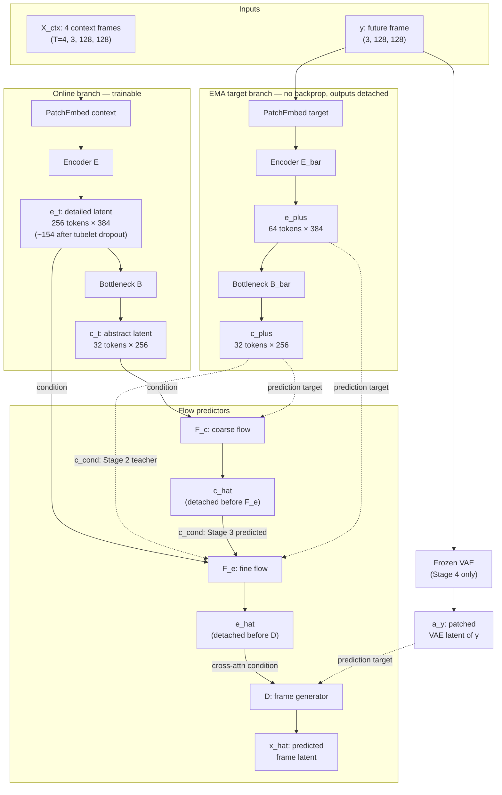
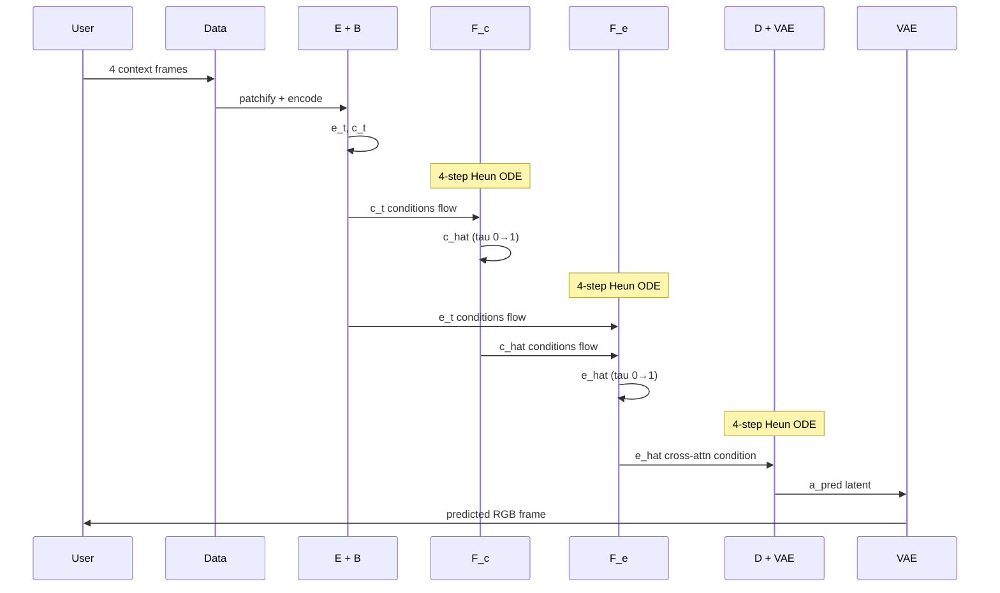

# HJEPA-VWM: Architecture & Phase-by-Phase Guide

> **Purpose:** A human-readable, in-depth walkthrough of what this project builds, how data flows through it, and what each implementation phase adds. Written to demystify the AI-generated specs and code.
>
> **Repo state:** Phase 1 is implemented (`config.py`, `data.py`, `models.py`, `losses.py`, `diagnostics.py`, `train.py`, `make_subset.py`). Phases 2 and 3 are fully specified in `AGENT_FILES/PHASES/` but not yet coded.
>
> **Authoritative sources:** `AGENT_FILES/KNOWLEDGE/UNDERSTANDING.md`, `AGENT_FILES/PHASES/PHASE_*.md`, and the architecture brief PDF.

---

## Table of contents

1. [What problem are we solving?](#1-what-problem-are-we-solving)
2. [The big picture in one diagram](#2-the-big-picture-in-one-diagram)
3. [Core concepts you need first](#3-core-concepts-you-need-first)
4. [The two-level latent hierarchy](#4-the-two-level-latent-hierarchy)
5. [Every module explained](#5-every-module-explained)
6. [Data: from video file to training batch](#6-data-from-video-file-to-training-batch)
7. [Flow matching: how prediction actually works](#7-flow-matching-how-prediction-actually-works)
8. [Losses and what they train](#8-losses-and-what-they-train)
9. [EMA target branch: why a second encoder exists](#9-ema-target-branch-why-a-second-encoder-exists)
10. [Stop-gradient rules (non-negotiable)](#10-stop-gradient-rules-non-negotiable)
11. [Training stages 0–4 (150k steps)](#11-training-stages-04-150k-steps)
12. [Phase 1 — Coarse hierarchy (implemented)](#12-phase-1--coarse-hierarchy-implemented)
13. [Phase 2 — Fine hierarchy (planned)](#13-phase-2--fine-hierarchy-planned)
14. [Phase 3 — Frame generation (planned)](#14-phase-3--frame-generation-planned)
15. [Diagnostics and bypass tests](#15-diagnostics-and-bypass-tests)
16. [Inference: predicting a future frame](#16-inference-predicting-a-future-frame)
17. [Code map: which file does what](#17-code-map-which-file-does-what)
18. [Glossary](#18-glossary)

---

## 1. What problem are we solving?

**HJEPA-VWM** (Hierarchical JEPA-Flow Video World Model) learns to **predict the future of a short video clip** — not by diffusing pixels, but by learning a **compressed internal representation** and predicting how that representation will change one frame ahead.

### What makes this different from "normal" video AI

| Typical video diffusion | HJEPA-VWM |
|---|---|
| Denoises pixels or VAE latents directly | Predicts **abstract** and **detailed latents** first |
| No forced hierarchy | **Two-level** hierarchy: structure (`c`) vs texture (`e`) |
| Hard to verify what the model "understands" | **Bypass tests** prove each level carries real signal |
| Encoder and decoder often trained together | Frame decoder **only after** latents are verified |

The thesis: a good world model should compress what matters for the future into a **small abstract state** (`c_t`), while keeping local appearance in a **larger detailed state** (`e_t`). If you shuffle or zero out `c`, fine prediction should get worse. If you shuffle `e_hat` at decode time, images should get worse. Those tests are the whole point.

### What the model sees and predicts

- **Input:** 4 context frames at 128×128 (`X_ctx`)
- **Target:** 1 future frame at 128×128 (`y`) — the next sampled frame after the context, one stride-2 step ahead. The full 5-frame clip (4 context + 1 target) spans ~0.83 s of source video (≈10 frames at SSv2's ~12 fps).
- **Dataset:** Something-Something V2 (SSv2) — short clips of human-object interactions where **direction and order matter** (e.g. "Moving something left" vs "right")

---

## 2. The big picture in one diagram

At full maturity (after Phase 3), one training step looks like this:

**How to read this:** solid arrows are forward data flow; dashed arrows are
**prediction targets** (always stop-gradient). The key chain to internalize is
`E → e_t → B → c_t`: the detailed latent `e_t` is literally the **input to the
bottleneck**, not a parallel output. The target branch mirrors it exactly.



**Phase 1** implements only the online branch, the EMA target branch, and `F_c` (coarse flow). **Phase 2** adds `F_e` (fine flow). **Phase 3** adds `D` and the frozen VAE.

---

## 3. Core concepts you need first

### JEPA (Joint Embedding Predictive Architecture)

Instead of reconstructing pixels, JEPA-style models **predict representations** of future content. The online encoder sees a **partial** view (context with dropout); a target encoder sees the **full** future frame and produces rich targets. The predictor must infer the future representation from context alone — like predicting the answer from incomplete information.

### Flow matching (rectified flow)

Rather than "jump" from context to future latent in one shot, the model learns a **velocity field** that transports Gaussian noise to the target latent along a straight path:

```
z(τ) = (1 - τ) · ε + τ · target     # interpolate noise ε and target
u = target - ε                       # constant velocity along that path
```

A network `F(z, τ, condition)` predicts velocity `u`. Training minimizes `||F(z, τ, cond) - u||²`. At inference, you integrate from τ=0 (pure noise) to τ=1 (prediction) using an ODE solver (4-step Heun in this project).

**Why flow matching here?** The generative path starts from `N(0,I)` noise, which pairs naturally with SIGReg (regularizing latents toward isotropic Gaussian). The same machinery is reused for coarse, fine, and frame generation.

### adaLN-Zero (DiT-style time conditioning)

Flow networks `F_c`, `F_e`, and `D` are transformer blocks where the flow time `τ` modulates LayerNorm scale/shift parameters. **Zero initialization** means blocks start as identity — training ramps up gently.

### SIGReg (Sketched Isotropic Gaussian Regularization)

A regularizer that pushes online latents `e_t` and `c_t` toward an isotropic Gaussian distribution. Prevents **representation collapse** (all tokens becoming identical). Active from step 0 on both latents.

### Tubelet dropout

On the **context path only**, 40% of the 256 patch tokens are randomly dropped before the encoder. Forces the model to infer from partial views (MAE/V-JEPA tradition). The bottleneck uses a kept-mask to reconstruct the spatial grid for ConvNeXt mixing.

---

## 4. The two-level latent hierarchy

Think of the hierarchy as **headline vs body text**:

| Latent | Symbol | Canonical shape | Scalar count | Role |
|---|---|---|---|---|
| **Abstract** | `c_t` | 32 × 256 | 8,192 | Future-relevant **structure** — what is happening, spatial layout of action |
| **Detailed** | `e_t` | 256 × 384 | 98,304 | **Texture**, local appearance, fine spatial detail |

The abstract latent is roughly **8% of the detailed latent's scalar bandwidth** (8,192 / 98,304 ≈ 0.083). The brief calls this out explicitly: the bottleneck must be *tight enough to prevent copying* — if `c_t` had enough capacity, it would just mirror `e_t` and the hierarchy would be fake.

> **Note on token counts:** `e_t`'s canonical shape is `256 × 384` (4 frames × 8×8 patches). During **training**, tubelet dropout removes 40% of context tokens, so the encoder actually processes ~154 tokens that step. At eval/inference (no dropout) it is the full 256. `F_e` conditions on `e_t` via **cross-attention** (keys/values), so this variable length is handled naturally. (`F_c` never sees `e_t`; it conditions only on the fixed-size 32-token `c_t`.)

The bottleneck `B` is the architectural enforcement: it squeezes the detailed tokens into exactly **32 learned query slots** (Perceiver-style), regardless of input length.

**Future targets** use the same hierarchy on the EMA branch:

| Target | Symbol | Shape | Source |
|---|---|---|---|
| Future detailed | `e_plus` | 64 × 384 | `E_bar` on the future frame |
| Future abstract | `c_plus` | 32 × 256 | `B_bar` on `e_plus` |

Both are always **stop-gradient** — the online path learns to predict them, never to chase them directly.

---

## 5. Every module explained

### 5.1 PatchEmbed — turning pixels into tokens

**File:** `models.py` → `PatchEmbed`

A shared `Conv3d` with kernel `(1, 16, 16)` — patches each frame into 8×8 spatial tokens without merging across time.

| Path | Input | Output tokens |
|---|---|---|
| Context | `(B, 4, 3, 128, 128)` | 256 tokens × 384 dims |
| Target | `(B, 3, 128, 128)` as 1-frame clip | 64 tokens × 384 dims |

**Position embeddings:** Fixed 3D sin-cos (factorized T + H + W, summed). Not learned. The target frame uses **temporal index 4** — "the frame right after the 4-frame window."

**Context-only:** Tubelet dropout keeps ~60% of tokens (≈154). Target path: no dropout ever.

### 5.2 Online encoder E — VideoViT-Small

**File:** `models.py` → `OnlineEncoder`

Standard ViT-Small: 12 layers, 384 dim, 6 heads, pre-norm, no CLS token. Full self-attention over context tokens.

- Input: variable ~154 tokens (train) or 256 (eval)
- Output: `e_t` — same shape as input, one output per input token
- ~22M parameters

### 5.3 Bottleneck B — compression to abstract space

**File:** `models.py` → `Bottleneck`

Three-stage pipeline:

1. **Grid reconstruction + ConvNeXt mixing (2 blocks)**
   - Scatter `e_t` tokens back to 4 separate 8×8 grids (zero-fill dropped slots)
   - Run shared 2D ConvNeXt blocks per frame
   - Flatten back to tokens

2. **Cross-attention with 32 learned queries**
   - Queries: 32 fixed learnable embeddings (256-dim) — not derived from input
   - Keys/values: projected detailed tokens (384 → 256), 8 heads
   - Output: exactly 32 abstract tokens

3. **Output MLP + LayerNorm**

Target side (`c_plus`): same architecture on 64 target tokens reshaped to one 8×8 grid.

### 5.4 EMA target branch — E_bar + B_bar

**File:** `models.py` → `TargetBranch`

Structurally identical copies of `E` and `B`, but:
- `requires_grad = False` on all parameters
- Always in `eval()` mode
- No tubelet dropout on target path
- Outputs wrapped with `as_target()` (`.detach()`)

**Initialization (Stage 0):** `E_bar ← copy(E)`, `B_bar ← copy(B)`.

**Updates:** After each optimizer step in Stages 1–3, EMA blend:
```
θ_ema ← m · θ_ema + (1 - m) · θ_online
```
where `m` cosine-ramps from 0.996 → 0.9999 over 105k steps.

### 5.5 Coarse flow F_c — predict future abstract state

**File:** `models.py` → `CoarseFlow`

Predicts velocity from noise to `c_plus`, conditioned on current `c_t`.

- 6 DiT blocks, dim 256, 8 heads (~5M params)
- **Conditioning:** Concatenate `[z_c || c_t]` → 64 tokens, run self-attention across all 64, then read out the **first 32 tokens (the `z_c` half)** as the velocity prediction. (In code: `models.py` does `torch.cat([z_c, abstract], dim=1)` then returns `x[:, :n_c]`.) The `c_t` half acts purely as conditioning context that the `z_c` tokens attend to.
- **Condition dropout:** 10% of examples replace `c_t` with a learned null embedding (the `null_condition` parameter), CFG-style
- **Time:** adaLN-Zero from `τ_c`

**Phase 1 trains only this flow** (plus E and B).

### 5.6 Fine flow F_e — predict future detailed state (Phase 2)

**Not yet in `models.py`.** Specified in Phase 2.

Predicts velocity from noise to `e_plus`, conditioned on `e_t` and a coarse condition `c_cond`.

- 8 transformer blocks, dim 384, 8 heads (~14M params)
- Self-attention on 64 noised target tokens `z_e`
- Cross-attention to memory = `concat(e_t, proj(c_cond))`
- 10% condition dropout replaces **entire memory** with learned null

**`c_cond` depends on training stage:**
- Stage 2: `c_cond = c_plus` (teacher-forced — oracle future abstract state)
- Stage 3: `c_cond = stopgrad(c_hat)` where `c_hat` is F_c's one-step prediction

### 5.7 Frame generator D — pixels via VAE latent (Phase 3)

**Not yet implemented.**

Renders the future frame in **frozen Stable Diffusion VAE latent space**, conditioned on `stopgrad(e_hat)`.

- VAE: `stabilityai/sd-vae-ft-mse` — encodes 128×128 RGB → `(4, 16, 16)` latent
- Patchify VAE latent with 2×2 patches → 64 tokens × 16 dims
- 12 DiT blocks, dim 512, 8 heads (~38M params)
- Cross-attention from VAE tokens to projected `e_hat`
- Flow matching on patched VAE latent (same rectified-flow recipe)

### 5.8 VAE wrapper (Phase 3)

Frozen `AutoencoderKL` from diffusers. Encode/decode only; never trained. Pixel values in `[-1, 1]` to match VAE expectations.

---

## 6. Data: from video file to training batch

### 6.1 RunPod layout

```
/workspace/data/ssv2/train/          ← symlinks to .webm files
/workspace/data/ssv2/validation/
/workspace/data/ssv2/labels.json
/workspace/data/ssv2_tiny/           ← smoke subset (~4k train / 348 val)
/workspace/checkpoints/
/workspace/hierarchal-jepa-flow-world-model/   ← this repo
```

### 6.2 `make_subset.py` — creating ssv2_tiny

Stratified random sample: ~23 train + ~2 val videos per SSv2 class (174 classes). Creates **symlinks only** — no re-encoding. Writes `manifest.json` with seed and counts.

### 6.3 `data.py` — what each batch contains

**File:** `data.py` → `SSV2Dataset`

Each `__getitem__` returns:

| Field | Shape | Range |
|---|---|---|
| `context_clip` | `(4, 3, 128, 128)` | `[-1, 1]` |
| `future_frame` | `(3, 128, 128)` | `[-1, 1]` |

**Sampling:**
- Load video with `decord` (CPU, per dataloader worker)
- SSv2 ~12 fps; sample 5 frames with **stride 2** → frames 0–3 are context, frame 4 is target
- Random temporal start index each epoch

**Augmentations (train):** Resize shorter side to 128, random crop, color jitter (no hue). **No** horizontal flip, temporal flip, or rotation — SSv2 labels are direction-sensitive.

**Eval:** Center crop, no jitter.

**Batch size:** 64 clips globally.

---

## 7. Flow matching: how prediction actually works

### Training-time construction (coarse example)

For each batch element:

```python
# 1. Get detached future targets from EMA branch (returns BOTH latents)
e_plus, c_plus = TargetBranch(future_frame)   # detached; F_c uses c_plus

# 2. Sample noise and flow time
eps_c ~ N(0, I)                       # (32, 256)
tau_c ~ Uniform(0, 1)                 # scalar

# 3. Build interpolated state and ground-truth velocity
z_c = (1 - tau_c) * eps_c + tau_c * c_plus
u_c = c_plus - eps_c                  # constant along rectified-flow path

# 4. Predict velocity conditioned on current abstract state
u_c_hat = F_c(z_c, tau_c, c_t)

# 5. Loss
L_c = mean((u_c_hat - u_c) ** 2)
```

The network learns: *given where I am along the noise→target path (`z_c`, `τ_c`) and what the context means (`c_t`), what velocity should I output?*

### One-step prediction (`c_hat`) — used in Stage 3

Under rectified flow, a single Euler step from `z_c` with predicted velocity gives an estimate of the endpoint:

```python
c_hat = z_c + (1 - tau_c) * u_c_hat
```

This is **detached** before feeding `F_e` so fine-loss gradients never flow back into `F_c` through the conditioning path.

### Inference-time (multi-step Heun)

Training often uses one-step estimates for speed. **Deployment** integrates 4 Heun steps from τ=0 to τ=1:

```
z ← eps ~ N(0,I)
for each step: z ← heun_step(z, F_c(z, tau, c_t), dt)
c_hat_final ← z at tau=1
```

Same pattern for `F_e` (conditioned on `c_hat_final`) and `D` (conditioned on `e_hat_final`).

---

## 8. Losses and what they train

> Reminder: **stages** are the training-schedule phases (0–4); **implementation phases** (1–3) are how the code is built. Stage 1 = Phase 1; Stages 2–3 = Phase 2; Stage 4 = Phase 3.

### Stage 1 total loss (Phase 1)

```
L = L_c + 0.10 · SIGReg(c_t) + 0.02 · SIGReg(e_t)
```

No `L_e` yet. SIGReg on both latents from step 0 prevents `e_t` drifting before fine flow exists.

### Stage 2–3 total loss (Phase 2, latent stages)

```
L = L_c + 1.0 · L_e + 0.10 · SIGReg(c_t) + 0.02 · SIGReg(e_t)
```

### Stage 4 total loss (Phase 3)

```
L = L_frame    # only D trains; everything else frozen
```

### Gradient routing summary

| Loss | Trains | Never trains |
|---|---|---|
| `L_c` | E, B, F_c | E_bar, B_bar, c_plus |
| `L_e` | E, B, F_e | c_plus, e_plus, c_hat (into F_e), **F_c** |
| SIGReg | E, B | EMA branch |
| `L_frame` | D only | E, B, F_c, F_e, VAE, e_hat |

---

## 9. EMA target branch: why a second encoder exists

If the online encoder predicted against its **own immediate** encoding of the future frame, two failure modes appear:

1. **Collapse** — representations become trivial constants that are easy to predict
2. **Chasing** — the target moves every gradient step; the predictor never stabilizes

The EMA branch provides **slow-moving, stable targets** (I-JEPA / V-JEPA practice):

- `E_bar`, `B_bar` lag behind `E`, `B` by thousands of steps
- Targets are always detached — the online path learns to **catch up to** a smoothed future, not to rewrite the target encoder

Only `E` and `B` are EMA'd. Flow networks and the frame generator are not.

---

## 10. Stop-gradient rules (non-negotiable)

These are architectural contracts. Breaking them invalidates the hierarchy tests.

| # | What | Why |
|---|---|---|
| 1 | `e_plus`, `c_plus` always detached | EMA targets are predictions, not optimization targets |
| 2 | `c_hat` detached before `F_e` | Prevents L_e from training F_c; stops `c` becoming a texture carrier |
| 3 | `e_hat` detached before `D` | Frame loss must not rewrite the world model |
| 4 | E_bar, B_bar never in optimizer | Updated by EMA only |
| 5 | Latent stack frozen in Stage 4 | Decoder cannot shortcut around verified latents |
| 6 | VAE frozen always | Pretrained appearance prior, not learned from scratch |

**Code pattern:** centralized `as_target(x)` in `losses.py` returns `x.detach()`.

---

## 11. Training stages 0–4 (150k steps)

```mermaid
gantt
    title Training timeline (global steps)
    dateFormat X
    axisFormat %s

    section Latent
    Stage 0 sanity           :0, 0
    Stage 1 coarse (Phase 1) :0, 30000
    Stage 2 teacher F_e      :30000, 25000
    Stage 3 predicted c_hat  :55000, 50000

    section Render
    Stage 4 frame gen D      :105000, 45000
```



| Stage | Steps | What's trained | Key conditioning | Phase |
|---|---|---|---|---|
| **0** | 0 (sanity only) | Nothing — synthetic forward/back | — | 1 |
| **1** | 0 → 30k | E, B, F_c | `c_t` → F_c | 1 |
| **2** | 30k → 55k | E, B, F_c, F_e | `c_cond = c_plus` (teacher) | 2 |
| **3** | 55k → 105k | E, B, F_c, F_e | Ramp `c_plus` → `stopgrad(c_hat)` | 2 |
| **4** | 105k → 150k | D only | `stopgrad(e_hat)` | 3 |

### Stage 3 ramp (steps 55k → 60k)

The transition from oracle coarse conditioning to model-predicted coarse must be gradual:

```python
alpha = min(1.0, (step - 55000) / 5000)
c_cond = (1 - alpha) * c_plus + alpha * stopgrad(c_hat)
```

After step 60k: `c_cond = stopgrad(c_hat)` only — matches deployment where you don't have the real future.

### Learning rates

| Module | LR | When active |
|---|---|---|
| E (encoder) | 2e-4 | Stages 1–3 |
| B (bottleneck) | 2e-4 | Stages 1–3 |
| F_c (coarse flow) | 4e-4 | Stages 1–3 |
| F_e (fine flow) | 4e-4 | Stages 2–3 |
| D (frame generator) | 2e-4 | Stage 4 only |

Latent schedule: 10k warmup, cosine decay over remaining 95k. Stage 4: separate 3k warmup + 42k cosine.

---

## 12. Phase 1 — Coarse hierarchy (implemented)

### What Phase 1 delivers

Phase 1 is a **vertical slice**: data loading → encoding → coarse prediction → training loop → diagnostics. It proves the abstract pathway works before adding complexity.

**Files created:**

| File | Responsibility |
|---|---|
| `config.py` | All locked constants (§2.6), paths, dataclasses |
| `make_subset.py` | SSv2-tiny symlink subset |
| `data.py` | Dataset, dataloader, augmentations |
| `models.py` | PatchEmbed, E, B, TargetBranch, F_c |
| `losses.py` | Flow matching, SIGReg, `as_target()` |
| `diagnostics.py` | Latent health, F_c baselines, grad health |
| `train.py` | Stage 0 sanity + Stage 1 loop |

### Phase 1 training step (what `train.py` does each step)

```
1. Load batch: context_clip (B,4,3,128,128), future_frame (B,3,128,128)
2. patchify context → E → e_t; B(e_t, mask) → c_t
3. TargetBranch(future_frame) → e_plus, c_plus (detached)
4. Sample eps_c, tau_c ~ U(0,1)
5. z_c = interpolate(c_plus, eps_c, tau_c)
6. u_c = velocity_target(c_plus, eps_c)
7. u_c_hat = F_c(z_c, tau_c, c_t)
8. L = L_c + SIGReg terms
9. backward, clip grad 1.0, optimizer step
10. EMA update: E_bar, B_bar ← blend from E, B
```

> **LR schedule subtlety (read the code carefully):** §11 describes the *full* latent schedule — 10k warmup then cosine decay over the remaining 95k of the 105k latent budget. But Phase 1 is shipped as a **standalone** 30k-step deliverable, so `train.py`'s `apply_lr_schedule` cosine-decays to 0 over `stage1_steps` (30k), per `PHASE_1.md` §10.2. When Phase 2 resumes from the 30k checkpoint, the schedule is meant to continue the long 95k cosine instead. Both are intentional; just don't be surprised that the *current* Phase-1 code decays fully by step 30k.

### Stage 0 — synthetic sanity

Before touching real data, `train.py --stage0-only`:
- Builds all modules on GPU
- Copies E→E_bar, B→B_bar
- Runs one forward/backward on **random tensors**
- Asserts no NaN; EMA params moved slightly

Must complete in < 2 minutes. Catches shape bugs and broken gradient paths early.

### Phase 1 acceptance gates

Phase 1 is **done** when all of these pass on validation data:

| Gate | Criterion |
|---|---|
| F_c vs copy baseline | model L_c ≤ **0.70×** copy L_c (after 10k steps) |
| F_c vs batch-mean | model L_c ≤ **0.50×** batch-mean L_c |
| Latent health | effective rank c_t > 60, e_t > 90 |
| No collapse | < 30% dims with std < 0.1× median |
| Training stability | 30k steps complete, no NaN/OOM |

**Copy baseline** = predict `c_plus` by outputting `c_t` unchanged (identity). **Batch-mean** = predict every `c_plus` as the batch average. F_c must beat both — otherwise it's not learning real future structure.

### Commands

```bash
python train.py --stage0-only
python train.py --data ssv2_tiny --steps 500      # smoke
python train.py --data ssv2_tiny --steps 30000    # full Phase 1
```

### What Phase 1 explicitly does NOT include

- Fine flow `F_e`
- Shuffled-c bypass test
- Frame generator `D` or VAE
- Stages 2, 3, 4 training logic
- `eval.py`

---

## 13. Phase 2 — Fine hierarchy (planned)

### What Phase 2 adds

Phase 2 extends the codebase **without rewriting** Phase 1 modules. It adds the detailed prediction pathway and the **central architectural proof**: the shuffled-c test.

**New/modified files:**

| File | Change |
|---|---|
| `models.py` | + `FineFlow` (F_e) |
| `losses.py` | + L_e helpers, `predict_abstract_one_step()` |
| `diagnostics.py` | + shuffled-c, zero-c, teacher-vs-predicted |
| `train.py` | Stages 2–3, resume from Phase 1 ckpt |
| `config.py` | Stage boundaries, ramp steps, thresholds |

### Stage 2 — teacher-forced fine flow (30k → 55k)

The fine flow learns to predict `e_plus` with an **oracle** coarse condition:

```
c_cond = c_plus    # detached future abstract — "cheating" but intentional
```

This isolates F_e learning: can the detailed predictor work when given the **true** future structure? If not, the architecture is broken before we ask it to use predicted structure.

**Loss:** `L_c + L_e + SIGReg` (same as Stage 3 minus the ramp).

### Stage 3 — predicted-coarse fine flow (55k → 105k)

Now F_e must work with **F_c's guess** of the future abstract state:

```
u_c_hat = F_c(z_c, tau_c, c_t)
c_hat = z_c + (1 - tau_c) * u_c_hat
c_cond = stopgrad(c_hat)    # after ramp completes
```

This matches deployment: at inference you don't have `c_plus`, only what F_c predicts.

**Critical invariant:** `c_hat` is detached before entering F_e. L_e trains E, B, F_e — **not** F_c.

### The shuffled-c test — why Phase 2 exists

This is the **single most important diagnostic** in the project.

```python
L_e_real = fine_flow(..., c_cond=c_hat_real)
L_e_shuffled = fine_flow(..., c_cond=permute(c_hat across batch))
ratio = L_e_shuffled / L_e_real
```

| Checkpoint | Required ratio |
|---|---|
| End Stage 2 (55k) | ≥ **1.5** |
| End Stage 3 (105k) | ≥ **2.0** |

**Interpretation:**
- Ratio ≈ 1.0 → F_e **ignores** coarse conditioning → hierarchy is fake
- Ratio ≥ 2.0 → wrong coarse structure **hurts** prediction → `c` carries real signal

Related ablations:
- **Zero-c:** replace `c_cond` with null embedding — should hurt similarly
- **Teacher vs predicted gap:** L_e with `c_plus` vs `c_hat` — gap should narrow during Stage 3 but not instantly vanish

### Phase 2 acceptance gates

| Gate | Criterion |
|---|---|
| Resume | Phase 1 ckpt loads at step 30k |
| Shuffled-c @ 55k | ratio ≥ 1.5 |
| Shuffled-c @ 105k | ratio ≥ 2.0 |
| Zero-c ablation | null condition hurts L_e |
| F_c baselines | still pass Phase 1 thresholds |
| L_e ↛ F_c | autograd: no grad from L_e to F_c params via c_hat |
| Checkpoint @ 105k | loadable with correct global_step |

### Commands

```bash
python train.py --data ssv2_tiny --steps 105000 \
  --resume /workspace/checkpoints/phase1_step30000.pt
```

---

## 14. Phase 3 — Frame generation (planned)

### What Phase 3 adds

Phase 3 completes v0: turn verified latents into **visible pixels** via a frozen VAE and a flow-based frame generator. The latent stack is **frozen** — only `D` trains.

**New files:**

| File | Responsibility |
|---|---|
| `models.py` | + `VAEWrapper`, `FrameGenerator`, rollout helpers |
| `losses.py` | + `L_frame` |
| `train.py` | Stage 4 freeze logic + D training |
| `eval.py` | **NEW** — all seven diagnostic tests |
| `inference.py` (optional) | `predict_next_frame()` |

### Stage 4 training step (105k → 150k)

```
1. Load context_clip, future_frame
2. torch.no_grad():
     e_t, c_t = online_path(context)
     Build e_hat via one-step fine flow (predicted-coarse regime)
3. a_y = VAE.encode_and_patchify(future_frame)   # frozen target
4. Sample eps_x, tau_x; flow matching through D
5. L_frame only; backward updates D only
```

**No EMA updates** in Stage 4. **No SIGReg, L_c, or L_e.**

### Building `e_hat` for D conditioning

At training (speed): one-step Euler from F_e, same as Phase 2 formula:
```python
e_hat = z_e + (1 - tau_e) * u_e_hat
```

At inference (quality): 4-step Heun rollout of F_c then F_e:
```
c_hat = heun_integrate(F_c, c_t, steps=4)
e_hat = heun_integrate(F_e, e_t, c_hat, steps=4)
```

### Decoder dependency test

The frame-level equivalent of shuffled-c:

1. Generate with real `e_hat` → measure L_frame or visual quality
2. Shuffle `e_hat` across batch → regenerate
3. **Shuffled must be worse** (ratio > 1.2 on L_frame)

If shuffled `e_hat` still produces good frames, `D` learned its own appearance model and **bypassed** the world model.

### Phase 3 acceptance gates

| Gate | Criterion |
|---|---|
| VAE round-trip | encode/decode looks recognizable |
| Stage 4 stable | 45k steps, L_frame decreases, no NaN |
| Freeze verified | no latent param gradients in Stage 4 |
| Decoder dependency | shuffled e_hat degrades output |
| Inference | `predict_next_frame()` returns sane RGB |
| eval.py | all seven tests run; thresholds met or flagged |
| Checkpoint 150k | loadable end-to-end |

### Commands

```bash
python train.py --data ssv2_tiny --steps 150000 \
  --resume /workspace/checkpoints/checkpoint_step105000.pt

python eval.py --checkpoint /workspace/checkpoints/checkpoint_step150000.pt \
  --data ssv2_tiny --output-dir /workspace/checkpoints/eval_results/
```

---

## 15. Diagnostics and bypass tests

Diagnostics run every **500 steps** on a **fixed validation batch** (cached at init).

| Test | What it catches | Phase | Pass threshold |
|---|---|---|---|
| Latent std | Dimensions collapsing to zero | 1+ | < 30% dead dims |
| Effective rank | Low-rank collapse of c or e | 1+ | c_t > 60, e_t > 90 |
| Coarse baselines | F_c not learning real dynamics | 1 | ≤ 0.70 / ≤ 0.50 ratios |
| **Shuffled-c** | F_e ignoring abstract latent | 2 | ≥ 1.5 → ≥ 2.0 |
| Zero-c ablation | Decorative coarse conditioning | 2 | null hurts L_e |
| Teacher vs predicted | Ramp / F_c quality problems | 2 | gap narrows reasonably |
| Gradient health | NaN, explosion | 1+ | no repeated NaN |
| Decoder dependency | D bypassing world model | 3 | shuffled e_hat worse |

**The architecture exists to pass these tests.** A model that trains but fails shuffled-c or decoder-dependency has not learned a real hierarchy.

---

## 16. Inference: predicting a future frame

Full pipeline at deployment (after 150k steps):



Entry point (Phase 3): `predict_next_frame(context_clip, models, cfg)` → `(B, 3, 128, 128)` in `[-1, 1]`.

---

## 17. Code map: which file does what

### Implemented (Phase 1)

```
config.py
├── ModelConfig     # architecture dims, patch geometry, dropout rates
├── TrainConfig     # steps, LRs, EMA, SIGReg weights, logging intervals
├── DataConfig      # data_root, dataset name, workers
└── Config          # bundles above + checkpoint_dir, seed

data.py
├── SSV2Dataset     # decord load, stride-2 sampling, augmentations
└── build_dataloader

make_subset.py
└── create_subset   # stratified symlinks → ssv2_tiny

models.py
├── PatchEmbed      # Conv3d patchify + sin-cos pos + tubelet dropout
├── OnlineEncoder   # ViT-S on context tokens → e_t
├── Bottleneck      # ConvNeXt + cross-attn queries → c_t
├── CoarseFlow      # F_c: DiT velocity predictor
├── TargetBranch    # E_bar + B_bar, copy_weights_from_online()
└── smoke_test_models()

losses.py
├── as_target()           # centralized detach
├── interpolate()         # z = (1-τ)ε + τ·target
├── velocity_target()     # u = target - ε
├── flow_matching_loss()
├── sigreg()
└── phase1_total_loss()

diagnostics.py
├── latent_std_stats()
├── effective_rank()
├── coarse_baselines()    # copy + batch-mean comparisons
└── gradient_health()

train.py
├── run_stage0()          # synthetic sanity
├── train_step()          # one Stage 1 step
├── run_training()        # full loop + W&B + checkpoints
└── run_diagnostics()
```

### Planned (Phases 2–3)

```
models.py       + FineFlow, VAEWrapper, FrameGenerator, rollout helpers
losses.py       + predict_abstract_one_step(), phase2/3 total loss, L_frame
diagnostics.py  + shuffled_c_test(), zero_c_ablation(), teacher_vs_predicted_gap()
                + decoder_dependency_test()
train.py        + stage detection, Stage 2/3/4 loops, freeze logic, resume
eval.py         + standalone seven-test evaluation script
inference.py    + predict_next_frame() (may live in models.py)
```

### Agent documentation (specs the AI follows)

```
AGENT_FILES/
├── AGENTS.md              # entry point, read order
├── KNOWLEDGE/
│   └── UNDERSTANDING.md   # full architecture reference (§0–§14)
├── PHASES/
│   ├── PHASE_1.md         # build spec Phase 1
│   ├── PHASE_2.md         # build spec Phase 2
│   └── PHASE_3.md         # build spec Phase 3
├── AGENT-BEHAVIOUR/
│   ├── PROTOCOL.md        # how agents must behave
│   └── CODE_DESIGN.md     # naming, file layout, docstrings
└── SETUPS/
    ├── SETUP.md           # human RunPod setup
    └── VOLUME_LAYOUT.md   # path contract
```

---

## 18. Glossary

| Term | Meaning |
|---|---|
| **Abstract latent `c`** | Low-bandwidth 32-token representation of future-relevant structure |
| **Detailed latent `e`** | High-bandwidth per-patch representation of visual detail |
| **`c_t` / `e_t`** | Latents of the **context** clip (online branch) |
| **`c_plus` / `e_plus`** | Latents of the **future** frame (EMA target branch, detached) |
| **`c_hat` / `e_hat`** | **Predicted** future latents from flow integration |
| **`c_cond`** | Coarse condition fed into F_e (`c_plus` or `c_hat`) |
| **Flow matching** | Learning velocity fields along noise→target paths |
| **Rectified flow** | Straight-path CFM: `z = (1-τ)ε + τ·target`, `u = target - ε` |
| **τ (tau)** | Flow time in [0,1]; 0 = pure noise, 1 = target |
| **EMA** | Exponential moving average — slow copy of online encoder for stable targets |
| **SIGReg** | Regularizer pushing latents toward isotropic Gaussian |
| **Tubelet dropout** | Random 40% drop of context patch tokens |
| **Condition dropout** | 10% replace conditioning with learned null (CFG-style) |
| **Teacher-forced** | Stage 2 uses oracle `c_plus` as F_e condition |
| **Predicted-coarse** | Stage 3+ uses F_c's `c_hat` as F_e condition |
| **Shuffled-c test** | Permute coarse conditions across batch — must hurt L_e |
| **Bypass test** | Any diagnostic proving a module can't be ignored |
| **Heun ODE** | 2nd-order ODE integrator for inference rollouts (4 steps) |
| **SSv2** | Something-Something V2 dataset |
| **ssv2_tiny** | Stratified ~4k subset for fast smoke training |

---

## Quick reference: phase → stage → capability

| Phase | Global steps | Stages | You can... |
|---|---|---|---|
| **1** | 0 – 30k | 0, 1 | Encode video → abstract latent; predict future `c_plus` with F_c |
| **2** | 30k – 105k | 2, 3 | Also predict future `e_plus` with F_e; prove hierarchy via shuffled-c |
| **3** | 105k – 150k | 4 | Render predicted future frame as RGB via D + VAE |

---

## Suggested reading order for you

1. This document — full pipeline mental model
2. `AGENT_FILES/KNOWLEDGE/UNDERSTANDING.md` §1, §4, §5, §6 — precise shapes and gradient table
3. `models.py` + `train.py` — see Phase 1 code matching the diagrams above
4. `AGENT_FILES/PHASES/PHASE_2.md` — before fine flow is implemented
5. Architecture brief PDF — tech lead's original intent

When Phase 2 or 3 code lands, re-read the corresponding section here and trace one `train_step()` in `train.py` against the Stage 2/3/4 pseudocode in §12–§14.
